# AI Capabilities — Complete Reference

> Every AI activity in the Agentic Platform, explained end-to-end with visual flow diagrams.

---

## Table of Contents

1. [Retrieval Augmented Generation (RAG)](#1-retrieval-augmented-generation-rag)
2. [Agent Reasoning Engine (ReAct Loop)](#2-agent-reasoning-engine-react-loop)
3. [Multi-Provider LLM Abstraction](#3-multi-provider-llm-abstraction)
4. [Advanced Retrieval Strategies](#4-advanced-retrieval-strategies)
5. [Tool Calling System](#5-tool-calling-system)
6. [Guardrails Engine](#6-guardrails-engine)
7. [Conversation Memory & Session Summaries](#7-conversation-memory--session-summaries)
8. [Multi-Agent Orchestration](#8-multi-agent-orchestration)
9. [Structured Data Querying (NL→SQL / NL→Pandas)](#9-structured-data-querying-nlsql--nlpandas)
10. [RAG Evaluation (Quality Scoring)](#10-rag-evaluation-quality-scoring)
11. [Skills System (Reusable Agent Capabilities)](#11-skills-system-reusable-agent-capabilities)
12. [MCP Protocol (Dynamic Tool Discovery)](#12-mcp-protocol-dynamic-tool-discovery)
13. [A2A Protocol (Agent-to-Agent Communication)](#13-a2a-protocol-agent-to-agent-communication)
14. [Data Connectors (Enterprise Ingestion)](#14-data-connectors-enterprise-ingestion)
15. [n8n Workflow Automation](#15-n8n-workflow-automation)
16. [Observability & LLM Tracing](#16-observability--llm-tracing)

---

## 1. Retrieval Augmented Generation (RAG)

RAG augments LLM responses with factual context retrieved from your own documents, eliminating hallucination and enabling domain-specific answers without model fine-tuning.

### How It Works

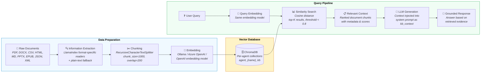

### Step-by-Step

| Step | Action | Component | Details |
|------|--------|-----------|---------|
| **A** | Upload raw document | `filestore.py` | Files staged on disk at `/data/filestore` with per-document directory isolation |
| **B** | Parse to text | `llamaindex_loader.py` | 15+ format-specific readers: `PDFReader`, `DocxReader`, `CSVReader`, `HTMLTagReader`, etc. Falls back to plain text |
| **C** | Chunk text | `vectorstore.py` | `RecursiveCharacterTextSplitter` with 1000-char chunks and 200-char overlap for context continuity |
| **D** | Generate embeddings | `llm.py` | Vectors via active embedding provider (configurable independently from LLM provider via `EMBEDDING_PROVIDER`) |
| **E** | Store vectors | `vectorstore.py` → ChromaDB | Each agent gets isolated collection `agent_{name}_kb` with source metadata preserved |
| **1** | Receive query | `graph.py` | User prompt enters the ReAct loop |
| **2** | Embed query | `llm.py` | Same embedding model used for ingestion |
| **3** | Search vectors | `vectorstore.py` | Cosine similarity, `k` results, score threshold < 0.8 filters irrelevant matches |
| **4** | Inject context | `graph.py` | Retrieved chunks injected into system prompt as `kb_context` section |
| **5** | Generate answer | LLM provider | LLM synthesises response grounded in retrieved evidence |

### Key Configuration

| Parameter | Default | Description |
|-----------|---------|-------------|
| `use_kb` | `true` | Enable/disable KB retrieval per agent |
| `retrieval_mode` | `basic` | One of: `basic`, `hybrid`, `reranked`, `sentence_window`, `auto_merging` |
| `chunk_size` | `1000` | Characters per chunk |
| `chunk_overlap` | `200` | Overlap between adjacent chunks |
| `k` (top-K) | `5` | Number of chunks to retrieve |
| `score_threshold` | `0.8` | Maximum distance for relevance (lower = stricter) |

### Source Files

- [`services/agent/agent/vectorstore.py`](../services/agent/agent/vectorstore.py) — Ingestion, chunking, ChromaDB CRUD
- [`services/agent/agent/llamaindex_loader.py`](../services/agent/agent/llamaindex_loader.py) — Multi-format document parsing
- [`services/agent/agent/filestore.py`](../services/agent/agent/filestore.py) — Document staging on disk
- [`services/agent/agent/llm.py`](../services/agent/agent/llm.py) — Embedding model selection

---

## 2. Agent Reasoning Engine (ReAct Loop)

The core AI runtime that processes user prompts through an iterative Reason-Act-Observe loop with autonomous tool calling.

### How It Works

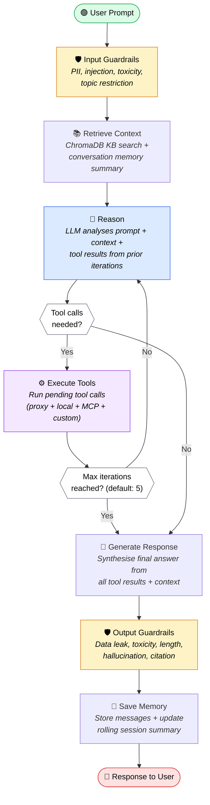

### The Four Graph Nodes

| Node | Purpose | What Happens |
|------|---------|--------------|
| **retrieve_context** | Gather knowledge | Auto-fetches top-K documents from ChromaDB collection + loads conversation memory summary |
| **reason** | Think & plan | Sends full context (prompt + history + KB + prior tool results) to LLM; parses structured tool-call JSON from response |
| **execute_tools** | Act | Dispatches each pending tool call to the appropriate executor (proxy HTTP, local function, MCP JSON-RPC, or custom HTTP) |
| **generate_response** | Synthesise | Compiles final answer from accumulated tool results; saves conversation to memory; updates session summary |

### Agent State

```python
class AgentState(TypedDict):
    prompt: str              # User's input
    history: list            # Conversation messages
    kb_context: str          # Retrieved KB documents
    tool_calls: list         # Pending tool calls from LLM
    tool_results: list       # Results from executed tools
    all_tool_results: list   # Accumulated across iterations
    response: str            # Final output
    iteration: int           # Current loop count
    agent_config: dict       # Agent-specific settings
    guardrail_results: dict  # Safety check outcomes
    session_id: str          # Conversation session ID
```

### Key Configuration

| Parameter | Default | Description |
|-----------|---------|-------------|
| `MAX_REACT_ITERATIONS` | `5` | Maximum reason→act→observe loops before forced response |
| `max_iterations` (per-agent) | `5` | Override at agent level |
| `temperature` | `0.7` | LLM creativity parameter |
| `memory_enabled` | `true` | Enable conversation persistence |
| `memory_window` | `10` | Number of history messages to include |

### Source Files

- [`services/agent/agent/graph.py`](../services/agent/agent/graph.py) — LangGraph `StateGraph`, node functions, guardrail logic

---

## 3. Multi-Provider LLM Abstraction

Unified interface supporting four LLM providers with runtime switching — no restart required.

### How It Works

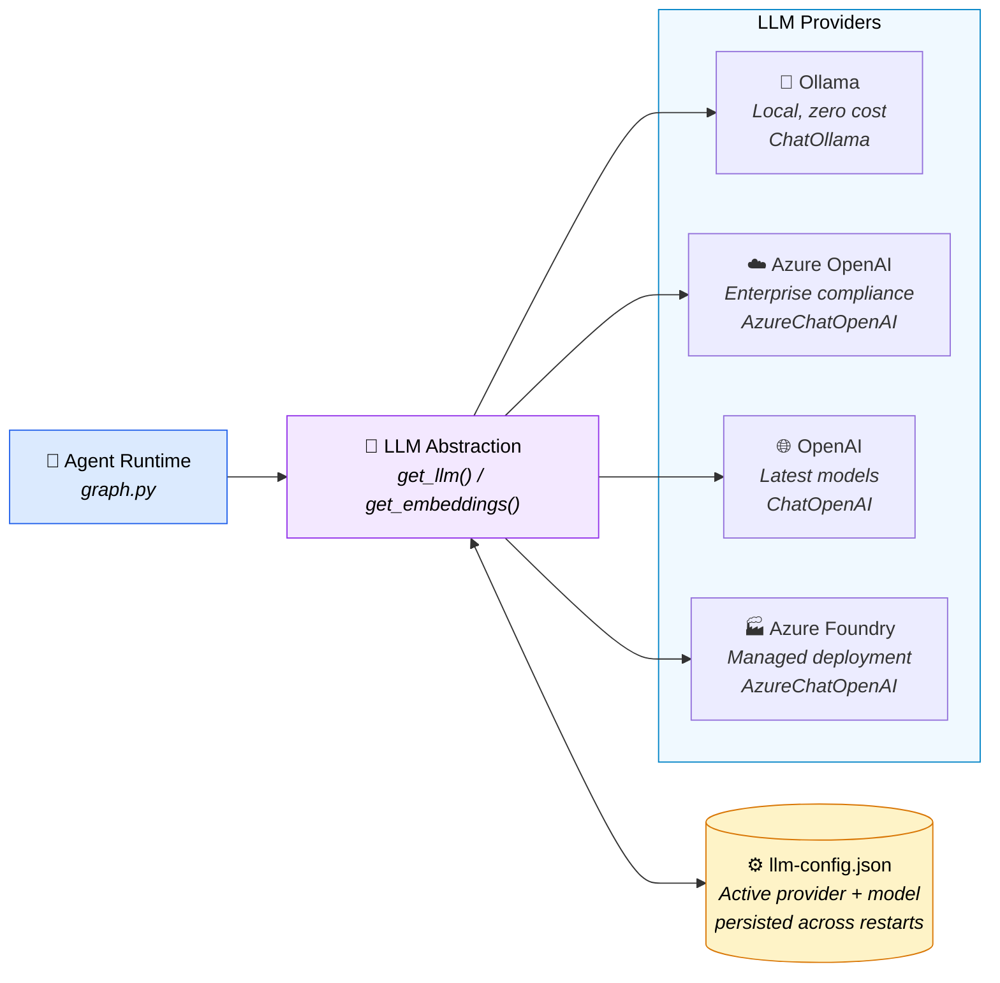

### Provider Details

| Provider | LLM Class | Embedding Class | Config Variables | Use Case |
|----------|-----------|-----------------|-----------------|----------|
| `ollama` | `ChatOllama` | `OllamaEmbeddings` | `OLLAMA_BASE_URL`, `OLLAMA_MODEL`, `OLLAMA_EMBED_MODEL` | Local dev, zero cost, air-gapped |
| `azure-openai` | `AzureChatOpenAI` | `AzureOpenAIEmbeddings` | `AZURE_OPENAI_API_KEY`, `AZURE_OPENAI_ENDPOINT`, `AZURE_OPENAI_DEPLOYMENT` | Enterprise compliance, managed |
| `openai` | `ChatOpenAI` | `OpenAIEmbeddings` | `OPENAI_API_KEY`, `OPENAI_MODEL` | Latest frontier models |
| `azure-foundry` | `AzureChatOpenAI` | `AzureOpenAIEmbeddings` | `AZURE_FOUNDRY_API_KEY`, `AZURE_FOUNDRY_ENDPOINT`, `AZURE_FOUNDRY_MODEL` | Managed model deployment |

### Runtime Switching

```
POST /models/switch  →  { "provider": "azure-openai", "model": "gpt-4o" }
```

- Takes effect immediately (no restart)
- Persisted to `data/llm-config.json` (survives container restart)
- Embedding provider can be set independently via `EMBEDDING_PROVIDER`
- Invalid/placeholder API keys auto-detected and rejected

### Source Files

- [`services/agent/agent/llm.py`](../services/agent/agent/llm.py) — Provider factory, embedding factory, config persistence
- [`data/llm-config.json`](../data/llm-config.json) — Active provider/model state

---

## 4. Advanced Retrieval Strategies

Five retrieval modes beyond basic cosine similarity, powered by LlamaIndex, to maximise context quality.

### How It Works

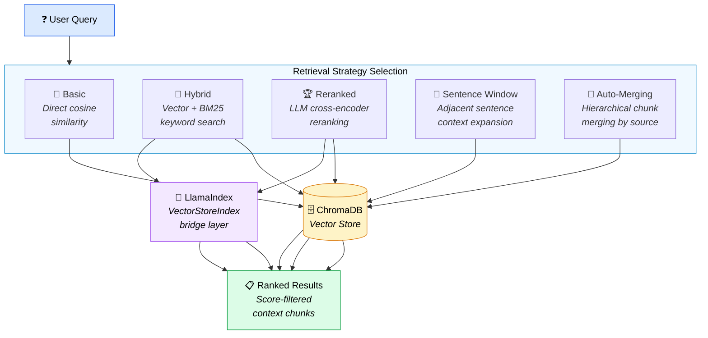

### Mode Comparison

| Mode | Strategy | How It Works | Best For |
|------|----------|-------------|----------|
| **`basic`** | Direct ChromaDB cosine similarity | Query embedded → cosine distance search → threshold filter < 0.8 | Simple keyword-aligned queries |
| **`hybrid`** | Vector + keyword (BM25) combined | Cosine similarity scores combined with BM25 keyword scores via configurable `alpha` weight (default 0.5) | Queries mixing domain terms with natural language |
| **`reranked`** | LLM cross-encoder reranking | Initial vector retrieval → LLM reranks top candidates by contextual relevance | High-stakes answers requiring precision |
| **`sentence_window`** | Surrounding sentence context | Returns chunks with adjacent sentence context from metadata, expanding the window around matches | Questions requiring broader passage context |
| **`auto_merging`** | Hierarchical chunk merging | Groups chunks by source document, merges adjacent chunks, averages scores for unified passages | Long documents where context spans multiple chunks |

### Integration Architecture

LlamaIndex bridges into existing LangChain infrastructure:
- LLM wrapped via `LangChainLLM` adapter
- Embeddings wrapped via `LangchainEmbedding` adapter  
- Vector store backed by existing ChromaDB collections (no data duplication)

### Source Files

- [`services/agent/agent/advanced_retrieval.py`](../services/agent/agent/advanced_retrieval.py) — All 5 retrieval modes, LlamaIndex bridge

---

## 5. Tool Calling System

35 tools split across two execution environments for security isolation, plus dynamic custom tools and MCP-discovered tools.

### How It Works

```mermaid
flowchart TD
    LLM["🧠 LLM Reasoning<br/><i>Decides which tools to call<br/>via structured JSON output</i>"]

    subgraph Proxy["Proxy Tools (tools-service :8011)"]
        direction TB
        P1["🔢 Math<br/><i>AST-safe eval</i>"]
        P2["🌐 Web<br/><i>http_fetch, web_search,<br/>webpage_extract</i>"]
        P3["📁 File I/O<br/><i>read, write, list, search<br/>sandboxed to /data/notes</i>"]
        P4["💻 Code Exec<br/><i>Sandboxed Python<br/>blocked imports</i>"]
        P5["📝 Text<br/><i>summarize, transform,<br/>diff, extract</i>"]
        P6["🔧 Utilities<br/><i>JSON, CSV, YAML,<br/>base64, hash, regex, ...</i>"]
    end

    subgraph Local["Local Tools (agent-service, in-process)"]
        direction TB
        L1["🔍 vector_search<br/><i>ChromaDB semantic search</i>"]
        L2["📥 vector_store<br/><i>Ingest text to KB</i>"]
        L3["🦙 advanced_search<br/><i>LlamaIndex multi-mode</i>"]
        L4["🤝 delegate_to_agent<br/><i>Multi-agent delegation</i>"]
        L5["🗃️ query_database<br/><i>NL → SQL</i>"]
        L6["📊 query_csv_data<br/><i>NL → Pandas</i>"]
    end

    subgraph Dynamic["Dynamic Tools"]
        direction TB
        CT["🛠️ Custom Tools<br/><i>User-defined HTTP endpoints<br/>stored in SQLite</i>"]
        MT["🔌 MCP Tools<br/><i>Auto-discovered from<br/>registered MCP servers</i>"]
    end

    LLM -->|"HTTP POST"| Proxy
    LLM -->|"Direct call"| Local
    LLM -->|"HTTP / JSON-RPC"| Dynamic

    style LLM fill:#dbeafe,stroke:#2563eb,color:#000
    style Proxy fill:#fee2e2,stroke:#dc2626,color:#000
    style Local fill:#dcfce7,stroke:#16a34a,color:#000
    style Dynamic fill:#f3e8ff,stroke:#9333ea,color:#000
```

### Security Controls

| Control | Protection |
|---------|-----------|
| **URL Whitelist** | `ALLOWED_FETCH_DOMAINS` — only whitelisted domains reachable via `http_fetch` |
| **SSRF Prevention** | Private IP ranges blocked (10.x, 172.16-31.x, 192.168.x, 127.x, fd00::/8) |
| **AST-Safe Math** | `ast.literal_eval` — no arbitrary code execution in math expressions |
| **Blocked Imports** | `os`, `sys`, `subprocess`, `shutil`, `importlib`, `__import__` blocked in `code_execute` |
| **Path Sandboxing** | File operations restricted to `/data/notes` directory |
| **Timeout** | 10-second execution limit per tool call |

### Tool Catalogue (35 tools)

<details>
<summary>Click to expand full tool list</summary>

| # | Tool | Type | Endpoint | Parameters |
|---|------|------|----------|------------|
| 1 | `math` | proxy | POST /tools/math | `expression` |
| 2 | `http_fetch` | proxy | POST /tools/http-fetch | `url` |
| 3 | `file_write` | proxy | POST /tools/file-write | `filename`, `content` |
| 4 | `file_read` | proxy | POST /tools/file-read | `filename` |
| 5 | `file_list` | proxy | POST /tools/file-list | `directory`, `pattern` |
| 6 | `file_search_content` | proxy | POST /tools/file-search-content | `query`, `pattern`, `max_results` |
| 7 | `datetime_tool` | proxy | POST /tools/datetime | _(none)_ |
| 8 | `web_search` | proxy | POST /tools/web-search | `query`, `max_results` |
| 9 | `code_execute` | proxy | POST /tools/code-execute | `code`, `language` |
| 10 | `text_summarize` | proxy | POST /tools/text-summarize | `text`, `max_sentences` |
| 11 | `text_transform` | proxy | POST /tools/text-transform | `text`, `operation` |
| 12 | `text_diff` | proxy | POST /tools/text-diff | `text_a`, `text_b`, `context_lines` |
| 13 | `text_extract` | proxy | POST /tools/text-extract | `text`, `extract_type` |
| 14 | `json_transform` | proxy | POST /tools/json-transform | `data`, `operation`, `jq_path` |
| 15 | `csv_parse` | proxy | POST /tools/csv-parse | `csv_text`, `operation`, `filter_column`, `filter_value` |
| 16 | `yaml_convert` | proxy | POST /tools/yaml-convert | `content`, `direction` |
| 17 | `base64_codec` | proxy | POST /tools/base64-codec | `text`, `operation` |
| 18 | `hash_generate` | proxy | POST /tools/hash-generate | `text`, `algorithm` |
| 19 | `uuid_generate` | proxy | POST /tools/uuid-generate | `count` |
| 20 | `regex_match` | proxy | POST /tools/regex-match | `text`, `pattern`, `flags` |
| 21 | `url_parse` | proxy | POST /tools/url-parse | `url` |
| 22 | `html_strip` | proxy | POST /tools/html-strip | `html`, `keep_links` |
| 23 | `markdown_to_html` | proxy | POST /tools/markdown-to-html | `markdown` |
| 24 | `webpage_extract` | proxy | POST /tools/webpage-extract | `url`, `max_length` |
| 25 | `dns_lookup` | proxy | POST /tools/dns-lookup | `hostname` |
| 26 | `json_schema_validate` | proxy | POST /tools/json-schema-validate | `data`, `schema_def` |
| 27 | `cron_parse` | proxy | POST /tools/cron-parse | `expression` |
| 28 | `jwt_decode` | proxy | POST /tools/jwt-decode | `token` |
| 29 | `environment_info` | proxy | POST /tools/environment-info | _(none)_ |
| 30 | `delegate_to_agent` | local | in-process | `agent_id`, `task` |
| 31 | `vector_search` | local | in-process (ChromaDB) | `query`, `k` |
| 32 | `vector_store` | local | in-process (ChromaDB) | `text`, `source` |
| 33 | `advanced_search` | local | in-process (LlamaIndex) | `query`, `mode`, `k` |
| 34 | `query_database` | local | in-process (SQL) | `question`, `connection_string`, `tables` |
| 35 | `query_csv_data` | local | in-process (Pandas) | `question`, `csv_path` |

</details>

### Source Files

- [`services/agent/agent/tools.py`](../services/agent/agent/tools.py) — Tool registry, proxy dispatch, local tools, custom/MCP tool builders
- [`services/tools/main.py`](../services/tools/main.py) — All 29 proxy tool implementations with sandboxing

---

## 6. Guardrails Engine

Input and output safety gates using LLM-based classification with regex fallback — every message is screened.

### How It Works

```mermaid
flowchart LR
    subgraph Input["Input Guardrails"]
        direction TB
        I1["🔒 PII Detection<br/><i>7 regex patterns:<br/>email, phone, SSN,<br/>credit card, IBAN,<br/>password, API key</i>"]
        I2["🛡️ Prompt Injection<br/><i>17 injection patterns +<br/>LLM detection</i>"]
        I3["☠️ Toxicity<br/><i>Hate speech, threats,<br/>slurs + Azure filter</i>"]
        I4["🚫 Topic Restriction<br/><i>Blocked/allowed<br/>topic lists</i>"]
    end

    PROMPT["❓ User Prompt"] --> Input

    LLM_C["🧠 Single LLM Call<br/><i>All enabled guardrails<br/>evaluated simultaneously<br/>in one classification prompt</i>"]

    Input --> LLM_C

    DEC{{"Severity?"}}
    LLM_C --> DEC

    BLOCK["🚫 BLOCKED<br/><i>critical / high severity</i>"]
    FLAG["⚠️ FLAGGED<br/><i>medium / low severity</i>"]
    PASS["✅ PASSED<br/><i>No violations detected</i>"]

    DEC -->|"critical/high"| BLOCK
    DEC -->|"medium/low"| FLAG
    DEC -->|"clean"| PASS

    PASS --> AGENT["🤖 Agent Processing"]
    FLAG --> AGENT

    AGENT --> OUTPUT

    subgraph Output["Output Guardrails"]
        direction TB
        O1["🔓 Data Leak<br/><i>System prompts, API keys,<br/>secrets in output</i>"]
        O2["☠️ Toxicity<br/><i>Hate, threats in response</i>"]
        O3["📏 Output Length<br/><i>Word count vs.<br/>configurable max</i>"]
        O4["🔮 Hallucination<br/><i>Fabricated facts,<br/>invented citations</i>"]
        O5["📑 Citation Check<br/><i>Source attribution<br/>verification</i>"]
        O6["⚖️ Bias Detection<br/><i>Stereotyping,<br/>prejudice</i>"]
    end

    style Input fill:#fee2e2,stroke:#dc2626,color:#000
    style Output fill:#fef3c7,stroke:#d97706,color:#000
    style LLM_C fill:#dbeafe,stroke:#2563eb,color:#000
    style BLOCK fill:#fca5a5,stroke:#dc2626,color:#000
    style FLAG fill:#fde68a,stroke:#d97706,color:#000
    style PASS fill:#bbf7d0,stroke:#16a34a,color:#000
```

### Guardrail Types

| ID | Type | Applied To | Detection Method | Fallback |
|----|------|-----------|-----------------|----------|
| `gr-pii` | PII Detection | Input + Output | 7 regex patterns (email, phone, SSN, credit card, IBAN, password, API key) | Regex always runs |
| `gr-prompt-injection` | Prompt Injection | Input | 17 known injection patterns + LLM semantic detection | Regex pattern matching |
| `gr-toxicity` | Toxicity | Input + Output | LLM classification + Azure content filter auto-trigger | Keyword matching |
| `gr-data-leak` | Data Leakage | Output | Detects system prompts, API keys, internal secrets in output | Pattern matching |
| `gr-bias` | Bias Detection | Output | Stereotyping, prejudice, discriminatory language | LLM-only |
| `gr-output-length` | Output Length | Output | Word count exceeds configurable maximum | Direct check |
| `gr-topic-restrict` | Topic Restriction | Input | Blocked/allowed topic lists from configuration | Keyword matching |
| `gr-hallucination` | Hallucination | Output | Fabricated facts, invented citations, unsupported claims | LLM-only |
| `gr-citation` | Citation Check | Output | Verifies source attribution in responses | LLM-only |

### Key Design Decisions

1. **Single LLM call** — All enabled guardrails evaluated in one prompt for latency efficiency
2. **Regex fallback** — If LLM call fails, regex/heuristic checks still protect the pipeline
3. **Azure content filter** — When Azure OpenAI rejects content, toxicity/bias guardrails auto-trigger
4. **Per-agent assignment** — Each agent can have different guardrail sets via `guardrail_ids`

### Source Files

- [`services/agent/agent/graph.py`](../services/agent/agent/graph.py) — Guardrail evaluation logic, classification prompt generation, fallback patterns

---

## 7. Conversation Memory & Session Summaries

Persistent conversation storage with rolling summaries for long-term context retention.

### How It Works

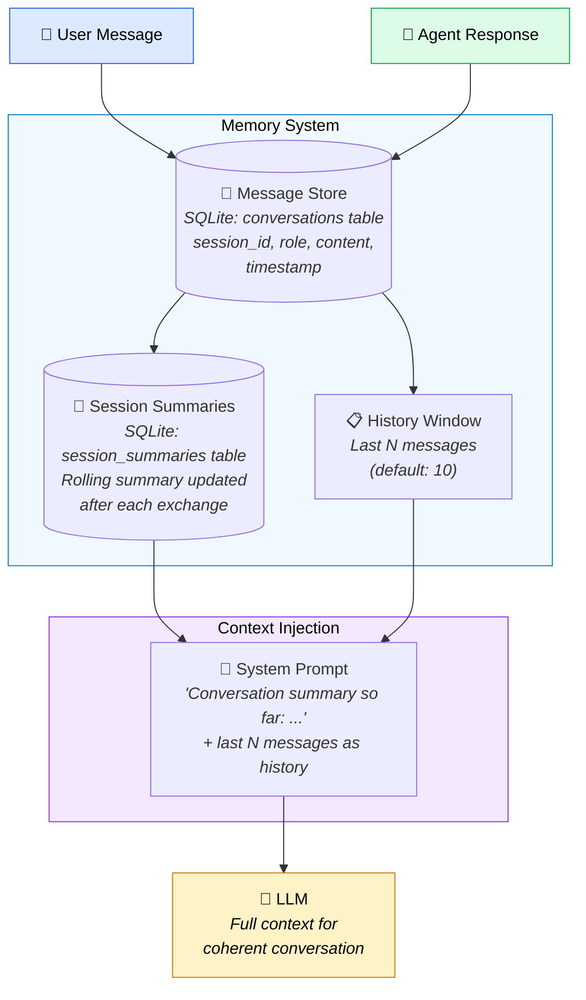

### What Gets Stored

| Table | Columns | Purpose |
|-------|---------|---------|
| `conversations` | `session_id`, `role`, `content`, `timestamp` | Every message (user, assistant, system) |
| `session_summaries` | `session_id`, `summary`, `updated_at` | Rolling LLM-generated summary of conversation so far |

### How Summaries Work

1. After each agent response, `update_session_summary()` is called
2. Previous summary + latest exchange → LLM generates updated summary
3. Summary injected into next request's system prompt as "Conversation summary so far"
4. This enables context retention beyond the history window without token explosion

### Key Configuration

| Parameter | Default | Description |
|-----------|---------|-------------|
| `memory_enabled` | `true` | Enable/disable per agent |
| `memory_window` | `10` | Number of recent messages included verbatim in prompt |

### Source Files

- [`services/agent/agent/memory.py`](../services/agent/agent/memory.py) — SQLite CRUD for conversations and summaries

---

## 8. Multi-Agent Orchestration

Hierarchical agent delegation — an orchestrator agent routes sub-tasks to specialist agents.

### How It Works

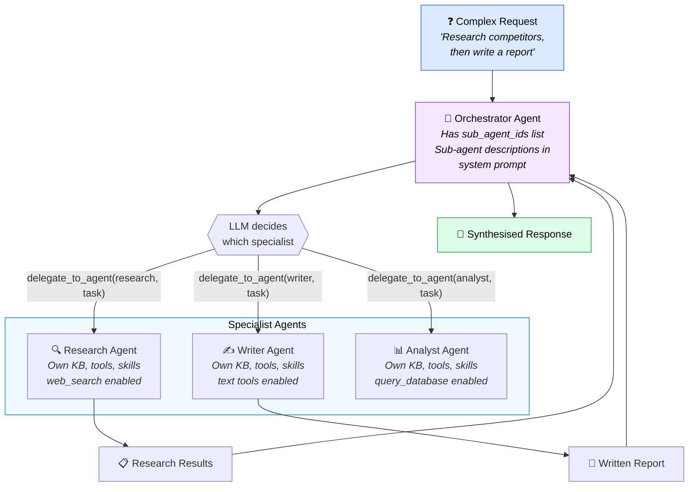

### Two Orchestration Modes

| Mode | How It Works | When to Use |
|------|-------------|-------------|
| **Runtime Delegation (LLM-decided)** | Orchestrator's LLM autonomously calls `delegate_to_agent(agent_id, task)` tool based on sub-agent descriptions in system prompt | Dynamic routing — LLM picks the best specialist |
| **Deterministic Pipelines (n8n DAGs)** | n8n workflows define fixed execution order: sequential (A→B chain with output passing) or parallel (A+B simultaneous, results merged) | Fixed workflows — guaranteed execution order |

### Safety: Recursion Guard

Each delegation creates a **fresh session ID** to prevent infinite delegation loops. Sub-agents cannot delegate back to the orchestrator.

### Source Files

- [`services/agent/agent/tools.py`](../services/agent/agent/tools.py) — `delegate_to_agent` tool implementation
- [`services/agent/agent/graph.py`](../services/agent/agent/graph.py) — `_build_agent_context` injects sub-agent descriptions
- [`n8n/workflows/multi-agent-orchestration.json`](../n8n/workflows/multi-agent-orchestration.json) — Deterministic pipeline workflow

---

## 9. Structured Data Querying (NL→SQL / NL→Pandas)

Natural language queries over SQL databases and CSV/DataFrame data — no code required.

### How It Works

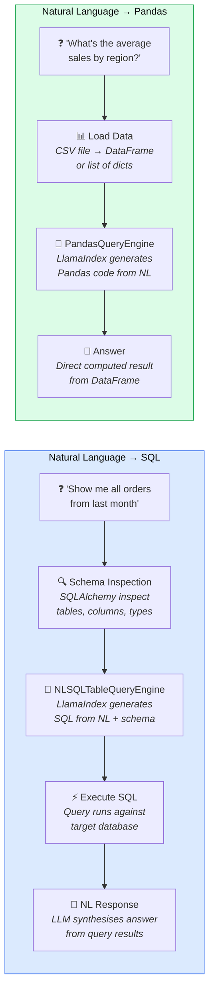

### Available Functions

| Function | Engine | Input | Output |
|----------|--------|-------|--------|
| `query_sql()` | LlamaIndex `NLSQLTableQueryEngine` | NL question + connection string + table names | Generated SQL + result rows + NL answer |
| `query_csv()` | LlamaIndex `PandasQueryEngine` | NL question + CSV file path | Pandas-computed answer |
| `query_dataframe()` | LlamaIndex `PandasQueryEngine` | NL question + list of dicts | Pandas-computed answer |
| `get_table_schema()` | SQLAlchemy `inspect` | Connection string | Table names, column names, column types |

### Source Files

- [`services/agent/agent/structured_query.py`](../services/agent/agent/structured_query.py) — All query engines and schema inspection

---

## 10. RAG Evaluation (Quality Scoring)

Four-dimensional quality scoring for RAG responses, measuring faithfulness, relevancy, correctness, and guideline adherence.

### How It Works

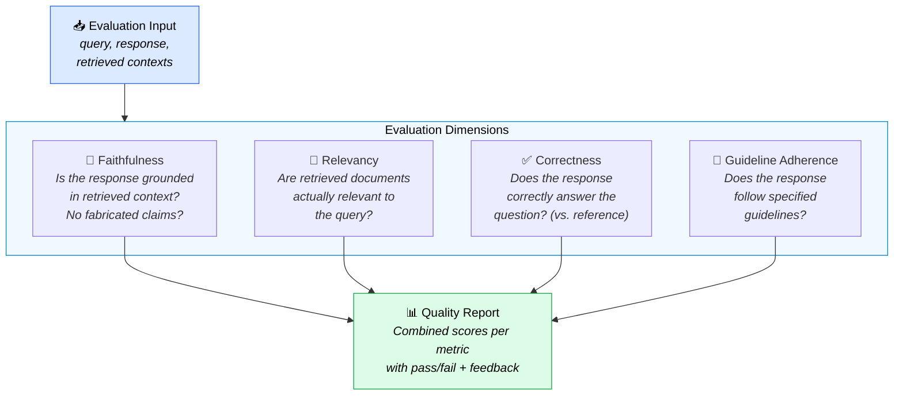

### Metrics Detail

| Metric | What It Measures | Inputs Required | Evaluator |
|--------|-----------------|-----------------|-----------|
| **Faithfulness** | Response claims are supported by retrieved context — no hallucinated facts | query, response, contexts | `FaithfulnessEvaluator` |
| **Relevancy** | Retrieved documents are topically relevant to the user's query | query, response, contexts | `RelevancyEvaluator` |
| **Correctness** | Response correctly answers the question (optionally compared to a reference answer) | query, response, (reference) | `CorrectnessEvaluator` |
| **Guideline Adherence** | Response follows specified guidelines (e.g., "respond in formal tone", "cite sources") | query, response, guidelines | `GuidelineEvaluator` |

### API

```python
evaluate_rag_pipeline(
    query="What is the refund policy?",
    response="The refund policy allows returns within 30 days...",
    contexts=["Policy doc chunk 1", "Policy doc chunk 2"],
    reference="Returns accepted within 30 days with receipt",  # optional
    guidelines=["Cite the document section", "Use formal tone"]  # optional
)
```

### Source Files

- [`services/agent/agent/rag_evaluation.py`](../services/agent/agent/rag_evaluation.py) — LlamaIndex evaluator wrappers

---

## 11. Skills System (Reusable Agent Capabilities)

Package a prompt + tools + constraints + files + input parameters into reusable, composable agent capabilities.

### How It Works

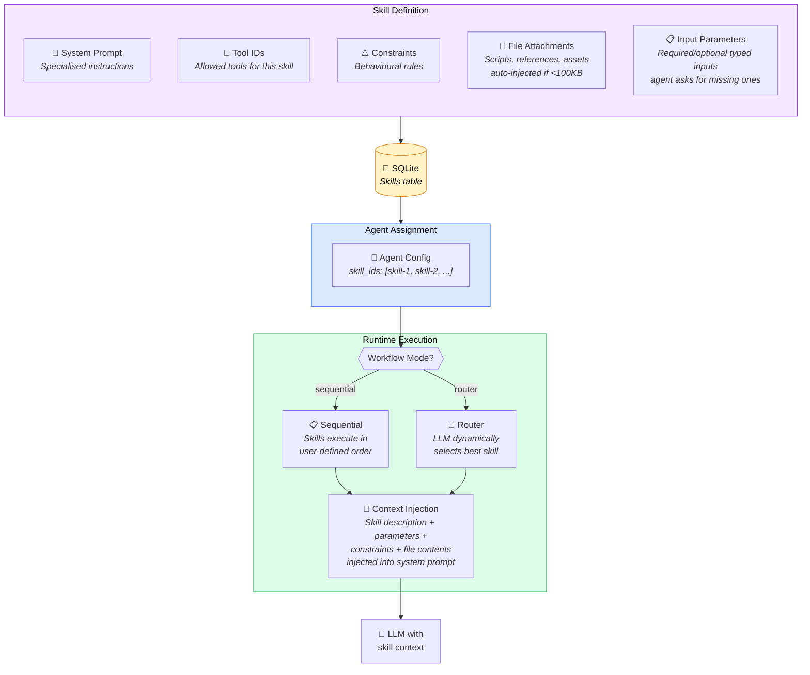

### Workflow Modes

| Mode | Behaviour | Use Case |
|------|----------|----------|
| **Sequential** | Skills execute in user-defined order (drag-to-reorder in UI) | Step-by-step workflows: "first research, then write, then review" |
| **Router** | LLM dynamically selects the best skill based on request content | Versatile agents: "pick the right expert for this question" |

### Source Files

- [`services/agent/agent/memory.py`](../services/agent/agent/memory.py) — Skill CRUD operations, file storage
- [`services/agent/agent/graph.py`](../services/agent/agent/graph.py) — Skill context injection into system prompt

---

## 12. MCP Protocol (Dynamic Tool Discovery)

External tool servers provide dynamic tool discovery and invocation via JSON-RPC 2.0.

### How It Works

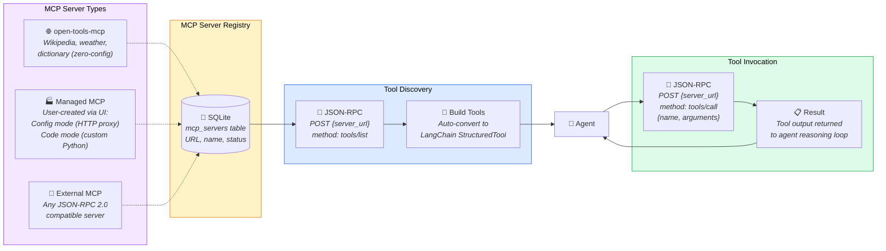

### Managed MCP Server Provisioning

Users create MCP servers from the UI in two modes:

| Mode | What You Provide | What Gets Deployed |
|------|-----------------|-------------------|
| **Config mode** | HTTP endpoint URL, method, headers, parameters | Proxy MCP server — routes tool calls to your API |
| **Code mode** | Custom Python function code | MCP server running your code as a tool |

Each managed server deploys as an **isolated Docker container** on the `platform-net` network.

### Source Files

- [`services/open-tools-mcp/server.py`](../services/open-tools-mcp/server.py) — Built-in MCP server with Wikipedia, weather, dictionary
- [`services/managed-mcp-base/server.py`](../services/managed-mcp-base/server.py) — Generic runtime for user-created MCP servers
- [`services/agent/agent/docker_manager.py`](../services/agent/agent/docker_manager.py) — Container lifecycle management
- [`services/agent/agent/tools.py`](../services/agent/agent/tools.py) — MCP tool discovery and invocation

---

## 13. A2A Protocol (Agent-to-Agent Communication)

Cross-framework agent interoperability over HTTP — any agent system (LangChain, AutoGen, CrewAI) can register and communicate.

### How It Works

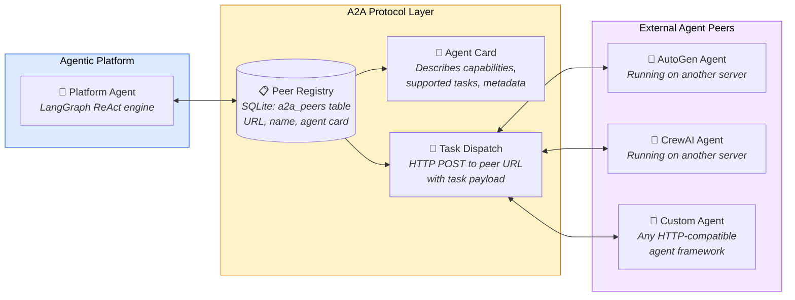

### Source Files

- [`services/agent/main.py`](../services/agent/main.py) — A2A peer CRUD endpoints and task dispatch

---

## 14. Data Connectors (Enterprise Ingestion)

Pull data from enterprise sources into the knowledge base — databases, cloud storage, APIs, and document management systems.

### How It Works

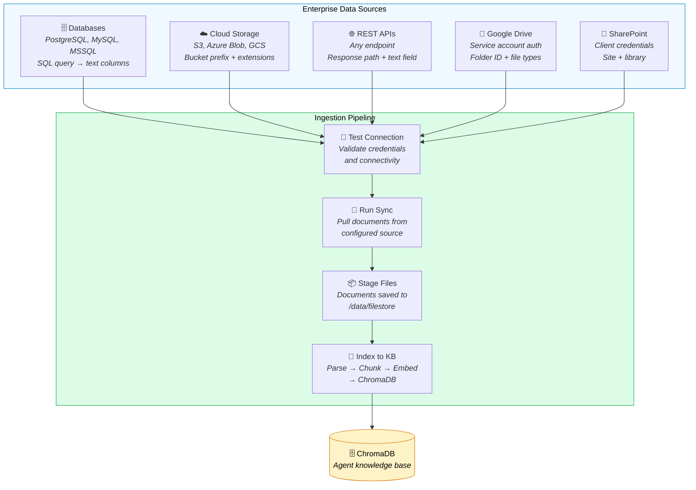

### Connector Types

| Type | Sources | Configuration |
|------|---------|--------------|
| `database` | PostgreSQL, MySQL, MSSQL | Host, port, credentials, SQL query, text columns |
| `cloud_storage` | S3, Azure Blob, GCS | Bucket, prefix, file extensions, credentials |
| `api` | Any REST endpoint | URL, method, headers, response path, text field |
| `google_drive` | Google Drive folders | Service account JSON, folder ID, file types |
| `sharepoint` | SharePoint document libraries | Site URL, client credentials, tenant ID, library |

### Source Files

- [`services/agent/agent/connectors/`](../services/agent/agent/connectors/) — `database.py`, `cloud_storage.py`, `api_connector.py`, `drives.py`, `sync_engine.py`

---

## 15. n8n Workflow Automation

Pre-built workflow templates for agent orchestration, RAG ingestion, web research, and scheduled tasks.

### How It Works

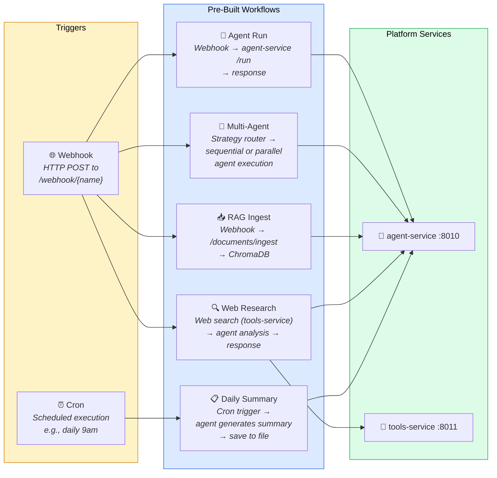

### Workflow Templates

| Workflow | Trigger | Pipeline | Output |
|----------|---------|----------|--------|
| **Agent Run** | `POST /webhook/agent-run` | Webhook → Call agent-service `/run` | Agent response |
| **Multi-Agent Orchestration** | `POST /webhook/multi-agent` | Strategy router → Sequential (A→B chain) or Parallel (A+B merge) | Combined results |
| **RAG Document Ingest** | `POST /webhook/rag-ingest` | Webhook → Call `/documents/ingest` → ChromaDB | Ingestion confirmation |
| **Web Research** | `POST /webhook/web-research` | Web search via tools-service → Agent analysis | Research report |
| **Daily Summary** | Cron `0 9 * * *` | Trigger → Agent generates summary → Save to file | Daily digest |

### Source Files

- [`n8n/workflows/agent-workflow.json`](../n8n/workflows/agent-workflow.json)
- [`n8n/workflows/multi-agent-orchestration.json`](../n8n/workflows/multi-agent-orchestration.json)
- [`n8n/workflows/rag-ingest.json`](../n8n/workflows/rag-ingest.json)
- [`n8n/workflows/web-research.json`](../n8n/workflows/web-research.json)
- [`n8n/workflows/scheduled-summary.json`](../n8n/workflows/scheduled-summary.json)

---

## 16. Observability & LLM Tracing

Three telemetry pipelines providing full visibility into LLM calls, agent behaviour, tool execution, and system health.

### How It Works

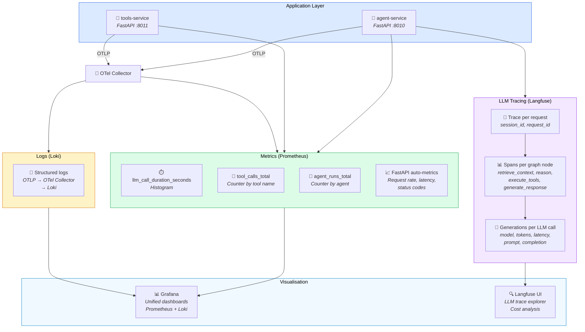

### Telemetry Pipelines

| Pipeline | Technology | What It Captures | Access |
|----------|-----------|-----------------|--------|
| **LLM Traces** | Langfuse SDK | Per-request traces with spans for each graph node, generation details (model, tokens, latency, prompts) | Langfuse UI |
| **Metrics** | Prometheus + `prometheus_fastapi_instrumentator` | `llm_call_duration_seconds`, `tool_calls_total`, `agent_runs_total`, request rate, latency, status codes | Grafana dashboards |
| **Logs** | OpenTelemetry → OTel Collector → Loki | Structured application logs from both services via OTLP | Grafana log explorer |

### Graceful Degradation

Langfuse tracing operates as **no-op fallback** when API keys are not configured — the agent runs without traces, never crashes.

### Source Files

- [`services/agent/agent/observability.py`](../services/agent/agent/observability.py) — Langfuse trace wrapper, Prometheus metric definitions
- [`services/otel/otel-collector.yaml`](../services/otel/otel-collector.yaml) — OTel Collector routing config
- [`observability/prometheus/prometheus.yml`](../observability/prometheus/prometheus.yml) — Scrape targets
- [`observability/grafana/dashboards/platform-health.json`](../observability/grafana/dashboards/platform-health.json) — Pre-built dashboard

---

## End-to-End System Architecture

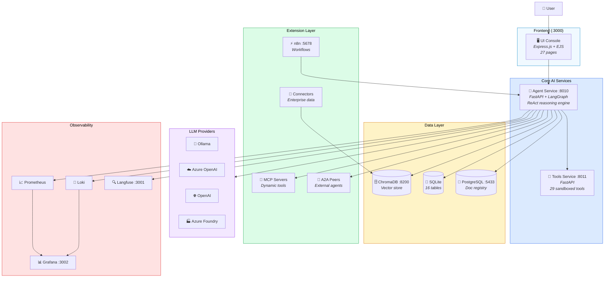

---

## Capability Cross-Reference

| # | Capability | Services Involved | Key Files | Protocol |
|---|-----------|-------------------|-----------|----------|
| 1 | RAG Pipeline | agent-service, ChromaDB | `vectorstore.py`, `llamaindex_loader.py`, `filestore.py` | Internal |
| 2 | ReAct Reasoning | agent-service | `graph.py` | LangGraph StateGraph |
| 3 | LLM Abstraction | agent-service | `llm.py`, `llm-config.json` | LangChain `BaseChatModel` |
| 4 | Advanced Retrieval | agent-service, ChromaDB | `advanced_retrieval.py` | LlamaIndex |
| 5 | Tool Calling | agent-service, tools-service | `tools.py`, tools `main.py` | HTTP proxy + in-process |
| 6 | Guardrails | agent-service | `graph.py` | LLM classification + regex |
| 7 | Memory | agent-service | `memory.py` | SQLite |
| 8 | Multi-Agent | agent-service, n8n | `tools.py`, `graph.py` | `delegate_to_agent` + n8n DAGs |
| 9 | NL→SQL/Pandas | agent-service | `structured_query.py` | LlamaIndex engines |
| 10 | RAG Evaluation | agent-service | `rag_evaluation.py` | LlamaIndex evaluators |
| 11 | Skills System | agent-service | `memory.py`, `graph.py` | SQLite + context injection |
| 12 | MCP Protocol | agent-service, MCP servers | `tools.py`, `docker_manager.py` | JSON-RPC 2.0 |
| 13 | A2A Protocol | agent-service, external agents | `main.py` | HTTP REST |
| 14 | Data Connectors | agent-service, ChromaDB | `connectors/` | Source-specific SDKs |
| 15 | n8n Workflows | n8n, agent-service, tools-service | `n8n/workflows/` | Webhooks + HTTP |
| 16 | Observability | all services | `observability.py`, OTel config | OTLP, Prometheus, Langfuse SDK |
