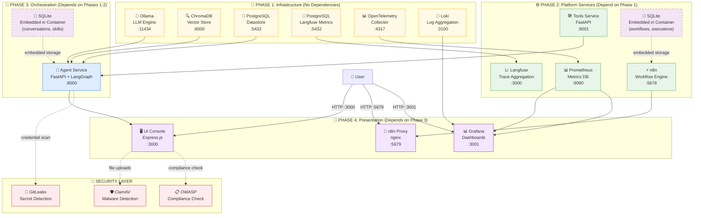
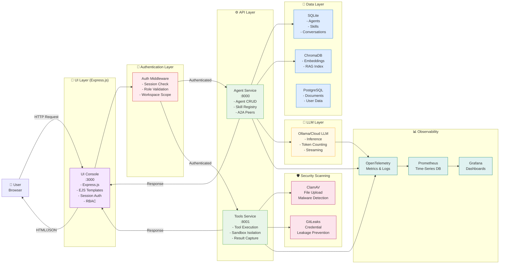
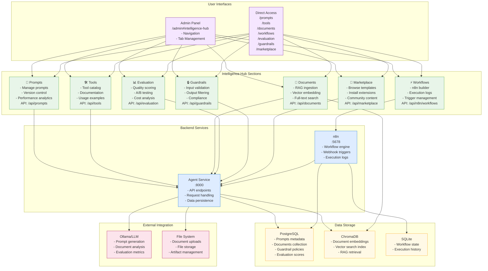

# Architecture

Comprehensive system architecture for the Agentic Platform with detailed component interactions, security controls, and data flows.

## System Overview

The Agentic Platform is a containerised agent factory built with:
- **Frontend**: Express.js + EJS (ui-console)
- **Agent Runtime**: FastAPI + LangGraph (agent-service)
- **Tool Runtime**: FastAPI (tools-service)
- **LLM Providers**: Ollama (local), Azure OpenAI, OpenAI, Azure AI Foundry
- **Knowledge Base**: ChromaDB (vector store, RAG)
- **Memory**: SQLite (conversations, agents, skills, A2A peers, MCP servers)
- **Workflows**: n8n (automation, webhooks)
- **Observability**: Prometheus + Grafana + Loki + OpenTelemetry + Langfuse
- **Security**: ClamAV (malware scanning), GitLeaks (credential detection), OWASP compliance

## 1. System Architecture Overview



## 2. Request-Response Flow (User Interaction)



## 3. Data Flow Paths

```mermaid
graph TB
    subgraph "Agent Execution Flow"
        UserQuery["User Query<br/>UI Console"]
        QueryAuth["Auth Check<br/>- Session<br/>- Workspace"]
        AgentParse["Parse Intent<br/>- LLM Inference<br/>- Tool Selection"]
        ToolExec["Execute Tools<br/>- Sandbox<br/>- Isolation"]
        Scan["Security Scan<br/>- ClamAV<br/>- GitLeaks"]
        RAG["RAG Retrieval<br/>- ChromaDB<br/>- Vector Search"]
        Response["Generate Response<br/>- LLM"]
        Store["Store Results<br/>- Conversation<br/>- History"]
        Return["Return to UI<br/>- Streaming<br/>- JSON"]
    end

    UserQuery --> QueryAuth
    QueryAuth -->|✓ Valid| AgentParse
    QueryAuth -->|✗ Denied| Return

    AgentParse --> ToolExec
    ToolExec --> Scan
    Scan -->|✓ Clean| RAG
    Scan -->|✗ Threat| Return

    RAG --> Response
    Response --> Store
    Store --> Return

    subgraph "File Upload Flow"
        Upload["File Upload<br/>UI"]
        UploadAuth["Auth Check"]
        MalwareCheck["ClamAV<br/>Scan"]
        TypeCheck["Magic Byte<br/>Detection"]
        Store2["Store File<br/>- DB<br/>- Filesystem"]
        Audit["Audit Log<br/>- Type<br/>- Size<br/>- Threat"]
        UploadReturn["Return Status"]
    end

    Upload --> UploadAuth
    UploadAuth -->|✓| MalwareCheck
    UploadAuth -->|✗| UploadReturn

    MalwareCheck -->|Clean| TypeCheck
    MalwareCheck -->|Threat| Audit
    TypeCheck --> Store2
    Store2 --> Audit
    Audit --> UploadReturn

    subgraph "Compliance Scan Flow"
        ScanTrigger["Scan Trigger<br/>- Manual<br/>- Scheduled"]
        SecretScan["GitLeaks<br/>Scan"]
        OWASPCheck["OWASP<br/>Assessment"]
        Report["Generate<br/>Report"]
        Audit2["Audit Log"]
        Download["Download<br/>Report"]
    end

    ScanTrigger --> SecretScan
    ScanTrigger --> OWASPCheck
    SecretScan --> Report
    OWASPCheck --> Report
    Report --> Audit2
    Audit2 --> Download

    classDef exec fill:#E8F5E9,stroke:#43A047
    classDef upload fill:#FFEBEE,stroke:#C62828
    classDef scan fill:#FCE4EC,stroke:#AD1457

    class UserQuery,QueryAuth,AgentParse,ToolExec,Scan,RAG,Response,Store,Return exec
    class Upload,UploadAuth,MalwareCheck,TypeCheck,Store2,Audit,UploadReturn upload
    class ScanTrigger,SecretScan,OWASPCheck,Report,Audit2,Download scan
```



## 4. Component Interaction Matrix

| Component | Interacts With | Method | Purpose |
|-----------|----------------|--------|---------|
| **UI Console** | Agent Service | REST API | Execute agents, manage skills |
| **UI Console** | Tools Service | REST API | Tool discovery, execution |
| **UI Console** | ClamAV | Direct | File malware scanning |
| **Agent Service** | ChromaDB | HTTP | RAG vector search |
| **Agent Service** | Ollama/Cloud LLM | HTTP/SDK | LLM inference |
| **Agent Service** | Tools Service | REST API | Tool invocation |
| **Agent Service** | n8n | HTTP | Workflow triggering |
| **Agent Service** | OTel Collector | gRPC | Metrics/logs export |
| **Tools Service** | Ollama/Cloud LLM | HTTP/SDK | Code generation, analysis |
| **Tools Service** | ClamAV | Direct | Executable scanning |
| **Tools Service** | GitLeaks | Direct | Credential detection |
| **n8n** | Agent Service | HTTP Webhook | Event-driven triggers |
| **OTel Collector** | Prometheus | HTTP | Metrics push |
| **OTel Collector** | Loki | gRPC | Log aggregation |
| **Prometheus** | Grafana | Datasource | Visualization |
| **Loki** | Grafana | Datasource | Log display |

## 5. Security Controls Placement

```mermaid
graph TB
    subgraph "Entry Layer Controls"
        AuthCtrl["🔐 Authentication<br/>- Session Validation<br/>- Token Verification<br/>- Rate Limiting"]
        RBACCtrl["🔐 RBAC<br/>- Role Check<br/>- Permission Validation<br/>- Workspace Scope"]
    end

    subgraph "Input Validation Layer"
        InputCtrl["✓ Input Validation<br/>- Type Checking<br/>- Schema Validation<br/>- Size Limits"]
        InjectionCtrl["🛡️ Injection Prevention<br/>- Query Parameterization<br/>- Prompt Injection Guards<br/>- XSS Prevention"]
    end

    subgraph "Tool Execution Layer"
        SandboxCtrl["📦 Sandboxing<br/>- Process Isolation<br/>- Resource Limits<br/>- No Root Exec"]
        ImportCtrl["🚫 Import Blocking<br/>- Dangerous Libs<br/>- System Access<br/>- File Write"]
    end

    subgraph "File Operations Layer"
        MalwareCtrl["🛡️ Malware Detection<br/>- ClamAV Scan<br/>- Signature Match<br/>- Heuristic Check"]
        CredCtrl["🔑 Credential Detection<br/>- GitLeaks Scan<br/>- Pattern Match<br/>- Entropy Check"]
        TypeCtrl["📋 File Type Verification<br/>- Magic Byte Check<br/>- Extension Validation<br/>- MIME Type"]
    end

    subgraph "API Layer"
        HTTPCtrl["🔒 HTTP Security<br/>- TLS 1.2+<br/>- CORS Policy<br/>- CSP Headers"]
        RateLimitCtrl["⏱️ Rate Limiting<br/>- Token Bucket<br/>- User Quota<br/>- Endpoint Limits"]
    end

    subgraph "Data Layer"
        EncryptCtrl["🔐 Encryption<br/>- At-Rest (Optional)<br/>- In-Transit (TLS)<br/>- Secret Masking"]
        AuditCtrl["📝 Audit Logging<br/>- All Operations<br/>- Timestamp<br/>- User ID<br/>- Action"]
    end

    subgraph "Output Layer"
        OutputCtrl["🎯 Output Sanitization<br/>- HTML Escaping<br/>- JSON Validation<br/>- Secret Redaction"]
    end

    subgraph "Compliance Layer"
        ComplianceCtrl["📋 Compliance<br/>- OWASP Scanning<br/>- Vulnerability Assessment<br/>- Policy Enforcement"]
    end

    Entry["User Request"]
    Entry --> AuthCtrl
    AuthCtrl --> RBACCtrl
    RBACCtrl --> InputCtrl
    InputCtrl --> InjectionCtrl

    InjectionCtrl --> SandboxCtrl
    SandboxCtrl --> ImportCtrl

    ImportCtrl --> MalwareCtrl
    MalwareCtrl --> CredCtrl
    CredCtrl --> TypeCtrl

    TypeCtrl --> HTTPCtrl
    HTTPCtrl --> RateLimitCtrl
    RateLimitCtrl --> EncryptCtrl
    EncryptCtrl --> AuditCtrl
    AuditCtrl --> OutputCtrl
    OutputCtrl --> ComplianceCtrl

    ComplianceCtrl --> Response["Response to User"]

    classDef auth fill:#FFEBEE,stroke:#C62828
    classDef input fill:#FFF9E6,stroke:#F9A825
    classDef sandbox fill:#E8F5E9,stroke:#43A047
    classDef scan fill:#FCE4EC,stroke:#AD1457
    classDef data fill:#DEECFF,stroke:#1976D2
    classDef output fill:#F5E6FF,stroke:#7B1FA2
    classDef compliance fill:#E0F2F1,stroke:#00796B

    class AuthCtrl,RBACCtrl auth
    class InputCtrl,InjectionCtrl input
    class SandboxCtrl,ImportCtrl sandbox
    class MalwareCtrl,CredCtrl,TypeCtrl scan
    class EncryptCtrl,AuditCtrl data
    class OutputCtrl output
    class ComplianceCtrl compliance
```



## 6. Integration Points

### External Integrations

| Integration | Type | Purpose | Status |
|-------------|------|---------|--------|
| **Ollama** | LLM | Local model inference | ✅ Implemented |
| **Azure OpenAI** | LLM | Enterprise cloud LLMs | ✅ Implemented |
| **OpenAI** | LLM | Commercial LLM API | ✅ Implemented |
| **ChromaDB** | Vector DB | RAG embeddings | ✅ Implemented |
| **Langfuse** | Tracing | LLM trace collection | ✅ Implemented |
| **n8n** | Workflows | Automation engine | ✅ Implemented |
| **Prometheus** | Metrics | Time-series monitoring | ✅ Implemented |
| **Grafana** | Visualization | Dashboard rendering | ✅ Implemented |
| **Loki** | Logging | Log aggregation | ✅ Implemented |
| **ClamAV** | Security | Malware detection | ✅ Implemented |
| **GitLeaks** | Security | Credential scanning | ✅ Implemented |

### API Endpoints by Service

#### Agent Service (`:8000`)
```
Agent Management:
  GET/POST /agents
  GET/PUT/DELETE /agents/{id}

Skill Management:
  GET/POST /skills
  GET/PUT/DELETE /skills/{id}

Execution:
  POST /agents/{id}/execute
  POST /agents/{id}/stream

Knowledge:
  GET/POST /documents
  POST /documents/search
```

#### Tools Service (`:8001`)
```
Tool Discovery:
  GET /tools
  GET /tools/{name}

Execution:
  POST /tools/{name}/execute

Security:
  POST /scan/malware
  POST /scan/credentials
```

#### UI Console (`:3000`)
```
Authentication:
  GET /login
  POST /auth/login
  POST /auth/logout

Admin Panel:
  GET /admin
  GET /admin#health (Service Health)
  GET /admin#secret-scan (Secret Scanning)
  GET /admin#owasp-scan (OWASP Assessment)
  GET /admin#clamav-scan (Antivirus Scan)

Agent Management:
  GET /agents
  POST /agents
  GET /agents/{id}
```

## 7. Storage & Persistence

| Service | Storage Type | Location | Details |
|---------|--------------|----------|---------|
| **n8n** | SQLite (Embedded) | Container volume: `/home/node/.n8n` | Workflows, executions, credentials stored in-container |
| **Agent Service** | SQLite (Embedded) | Python package data dir | Conversations, agents, skills, A2A peers, MCP servers (16 tables) |
| **Datastore** | PostgreSQL | External container | Document registry, structured data |
| **Langfuse** | PostgreSQL | External container | LLM traces, metrics, usage analytics |
| **ChromaDB** | Vector Database | In-memory + disk | RAG vector embeddings, persistent on disk |
| **Prometheus** | Time-series DB | Local storage | Metrics and monitoring data |

## 8. Phase Dependencies

- **Phase 1→2**: Infrastructure services start first (databases, LLM, search)
- **Phase 2→3**: Platform services available before orchestration
- **Phase 3→4**: Agent service must be ready before UI/presentation layer
- **Parallel Within Phase**: All services in the same phase start in parallel

## Services (8 source directories)

| Directory | Description |
| --------- | ----------- |
| `services/agent` | FastAPI agent-service — LangGraph ReAct agent, agent/skill/A2A/MCP registry |
| `services/managed-mcp-base` | MCP base service |
| `services/n8n-proxy` | Nginx proxy for n8n |
| `services/open-tools-mcp` | Open Tools MCP service |
| `services/otel` | OpenTelemetry Collector configuration |
| `services/tools` | FastAPI tools-service — math, HTTP, file, datetime tools, security scanning |
| `services/ui-console` | Express.js platform dashboard — 27 pages, API proxies, admin panel |
| `services/ui-login` | Authentication UI service |

## Telemetry Pipeline

```
agent-service → OTel Collector → Prometheus (metrics)
                               → Loki (logs)

agent-service → Langfuse SDK   → Langfuse (LLM traces)

UI Console    → OTel Collector → Prometheus
                               → Loki

Grafana ← Prometheus (metrics)
Grafana ← Loki (logs)
Langfuse Dashboard ← LLM Traces
```

## Protocols

- **A2A (Agent-to-Agent)**: Peer agents registered by URL; agents delegate sub-tasks via HTTP
- **MCP (Model Context Protocol)**: External tool servers provide dynamic tool discovery
- **REST API**: Synchronous request-response communication
- **WebSocket**: Real-time streaming (agent execution, logs)
- **gRPC**: High-performance telemetry export (OTel)
- **HTTP Webhooks**: Event-driven workflow triggers (n8n)

## 9. Intelligence Hub Architecture

The Intelligence Hub is the operational center for managing all AI assets, knowledge, and automation within the platform.



### Intelligence Hub Data Flow

1. **User Interaction**
   - User navigates to Admin Panel → Intelligence Hub section
   - User clicks sub-tab (Prompts, Tools, Documents, etc.)
   - Tab content loads via iframe: `/prompts?t={timestamp}`

2. **Prompts Section**
   - Load: `GET /api/prompts` → List all prompts
   - Create: `POST /api/prompts` → Store prompt + metadata
   - Search: Full-text search + semantic search (LLM-powered)
   - Reuse: Prompt templates available to all agents

3. **Documents Section**
   - Upload: `POST /api/documents/upload` → File storage + validation
   - Ingest: `POST /api/documents/ingest` → Chunking + embedding
   - Search: `POST /api/documents/search` → Vector similarity search (ChromaDB)
   - RAG: Documents retrieved during agent execution for context

4. **Workflows Section**
   - Browse: Embedded n8n UI at `:5679` (n8n-proxy)
   - Create: Visual workflow builder with nodes
   - Execute: Webhooks or scheduled triggers
   - Monitor: Execution logs and error tracking

5. **Evaluation Section**
   - Track: Agent response quality, latency, costs
   - Compare: A/B test results and metrics
   - Score: LLM-based evaluation via prompts from Prompts section

6. **Guardrails Section**
   - Define: Input/output validation rules
   - Enforce: Automatic checking on all requests
   - Report: Compliance violations logged and audited

7. **Marketplace Section**
   - Browse: Community templates and integrations
   - Install: One-click deployment via API
   - Manage: Installed extensions and dependencies

### Intelligence Hub Service Dependencies

```
Intelligence Hub
├─ Prompts
│  ├─ Agent Service (GET /api/prompts)
│  ├─ PostgreSQL (prompts table)
│  └─ Ollama (LLM analysis/generation)
│
├─ Tools
│  ├─ Agent Service (GET /api/tools)
│  └─ PostgreSQL (tools metadata)
│
├─ Documents
│  ├─ Agent Service (POST /api/documents/*)
│  ├─ ChromaDB (vector embeddings)
│  ├─ PostgreSQL (document metadata)
│  └─ FileSystem (uploaded files)
│
├─ Workflows
│  ├─ n8n Service (REST API, UI proxy)
│  ├─ n8n-Proxy (nginx, cross-origin)
│  └─ SQLite (workflow state)
│
├─ Evaluation
│  ├─ Agent Service (GET /api/evaluation)
│  ├─ PostgreSQL (scores/metrics)
│  └─ Ollama (LLM scoring)
│
├─ Guardrails
│  ├─ Agent Service (GET /api/guardrails)
│  └─ PostgreSQL (policies)
│
└─ Marketplace
   ├─ Agent Service (GET /api/marketplace)
   └─ PostgreSQL (templates/extensions)
```

### Admin Panel Integration

The Intelligence Hub is integrated into the Admin panel via:

1. **Navigation Mapping**
   - `SECTION_TABS.intelligence-hub = ['prompts', 'tools', 'documents', 'workflows', 'evaluation', 'guardrails', 'marketplace']`
   - `TAB_SECTION['prompts'] = 'intelligence-hub'` (and likewise for other tabs)

2. **Content Panels**
   - Each tab has a `<div id="tab-{name}">` container
   - Container loads iframe: `<iframe src="/{name}?t={timestamp}">`
   - Timestamp forces cache-busting for fresh data

3. **Tab Switching**
   - `switchTab(tabName)` function triggered on tab click
   - `loadIntelligenceHubTab(tabName)` called for Intelligence Hub tabs
   - Function refreshes iframe source to reload content

4. **Responsive Design**
   - Iframe height: `calc(100vh - 200px)` for full-height display
   - Border-radius: 8px for modern appearance
   - No cross-origin issues (same-domain iframe embedding)
