# Architecture

> **Auto-generated** — do not edit manually. Run `bash scripts/generate-docs.sh` to refresh.

## System Overview

The Agentic Platform is a containerised agent factory built with:
- **Frontend**: Express.js + EJS (ui-console)
- **Agent Runtime**: FastAPI + LangGraph (agent-service)
- **Tool Runtime**: FastAPI (tools-service)
- **LLM Providers**: Ollama (local), Azure OpenAI, OpenAI, Azure AI Foundry
- **Knowledge Base**: ChromaDB (vector store, RAG)
- **Memory**: SQLite (conversations, agents, skills, A2A peers, MCP servers)
- **Workflows**: n8n (automation, webhooks)
- **Observability**: Prometheus + Grafana + Loki + OpenTelemetry + Langfuse

## Services Topology Overview

The platform follows a **4-phase startup dependency model**, with services organized by their infrastructure requirements. Storage and persistence mechanisms are embedded within services or use dedicated database containers.

```mermaid
graph TB
    subgraph Phase1["🔧 PHASE 1: Infrastructure (No Dependencies)"]
        Ollama["🦙 Ollama<br/>LLM Engine<br/>:11434"]
        ChromaDB["🔍 ChromaDB<br/>Vector Store<br/>:8000"]
        DatastoreDB["🐘 PostgreSQL<br/>Datastore<br/>:5432"]
        LangfuseDB["🐘 PostgreSQL<br/>Langfuse Metrics<br/>:5432"]
        OTEL["📊 OpenTelemetry<br/>Collector<br/>:4317"]
        Loki["📝 Loki<br/>Log Aggregation<br/>:3100"]
    end
    
    subgraph Phase2["⚙️  PHASE 2: Platform Services (Depend on Phase 1)"]
        ToolsService["🛠️  Tools Service<br/>FastAPI<br/>:8001"]
        N8N["⚡ n8n<br/>Workflow Engine<br/>:5678"]
        N8NStorage["💾 SQLite<br/>Embedded in Container<br/>(workflows, executions)"]
        Langfuse["📈 Langfuse<br/>Trace Aggregation<br/>:3000"]
        Prometheus["📊 Prometheus<br/>Metrics DB<br/>:9090"]
    end
    
    subgraph Phase3["🤖 PHASE 3: Orchestration (Depends on Phases 1-2)"]
        AgentService["🧠 Agent Service<br/>FastAPI + LangGraph<br/>:8000"]
        AgentMemory["💾 SQLite<br/>Embedded in Container<br/>(conversations, skills)"]
    end
    
    subgraph Phase4["🎨 PHASE 4: Presentation (Depends on Phase 3)"]
        UIConsole["🖥️  UI Console<br/>Express.js<br/>:3000"]
        N8NProxy["🔀 n8n Proxy<br/>nginx<br/>:5679"]
        Grafana["📊 Grafana<br/>Dashboards<br/>:3001"]
    end
    
    DatastoreDB --> AgentService
    ChromaDB --> AgentService
    Ollama --> AgentService
    ToolsService --> AgentService
    LangfuseDB --> Langfuse
    OTEL --> Prometheus
    Loki --> Grafana
    Prometheus --> Grafana
    
    N8NStorage -.->|"embedded storage"| N8N
    AgentMemory -.->|"embedded storage"| AgentService
    
    AgentService --> UIConsole
    N8N --> N8NProxy
    Prometheus --> Grafana
    
    User["👤 User"]
    User -->|HTTP :3000| UIConsole
    User -->|HTTP :5679| N8NProxy
    
    classDef infra fill:#FFF9E6,stroke:#F9A825
    classDef platform fill:#E8F5E9,stroke:#43A047
    classDef core fill:#DEECFF,stroke:#1976D2
    classDef ui fill:#F5E6FF,stroke:#7B1FA2
    classDef storage fill:#F3E5F5,stroke:#AB47BC,stroke-dasharray: 5 5
    
    class Ollama,ChromaDB,DatastoreDB,LangfuseDB,OTEL,Loki infra
    class ToolsService,N8N,Langfuse,Prometheus platform
    class AgentService core
    class UIConsole,N8NProxy,Grafana ui
    class N8NStorage,AgentMemory storage
```



### Storage & Persistence

| Service | Storage Type | Location | Details |
|---------|--------------|----------|---------|
| **n8n** | SQLite (Embedded) | Container volume: `/home/node/.n8n` | Workflows, executions, credentials stored in-container |
| **Agent Service** | SQLite (Embedded) | Python package data dir | Conversations, agents, skills, A2A peers, MCP servers (16 tables) |
| **Datastore** | PostgreSQL | External container | Document registry, structured data |
| **Langfuse** | PostgreSQL | External container | LLM traces, metrics, usage analytics |
| **ChromaDB** | Vector Database | In-memory + disk | RAG vector embeddings |
| **Prometheus** | Time-series DB | Local storage | Metrics and monitoring data |

### Phase Dependencies

- **Phase 1→2**: Infrastructure services start first (databases, LLM, search)
- **Phase 2→3**: Platform services available before orchestration
- **Phase 3→4**: Agent service must be ready before UI/presentation layer
- **Parallel Within Phase**: All services in the same phase start in parallel

## Services (8 source directories)

| Directory | Description |
| --------- | ----------- |
| `services/agent` | FastAPI agent-service — LangGraph ReAct agent, agent/skill/A2A/MCP registry |
| `services/managed-mcp-base` | Service |
| `services/n8n-proxy` | Service |
| `services/open-tools-mcp` | Service |
| `services/otel` | OpenTelemetry Collector configuration |
| `services/tools` | FastAPI tools-service — math, HTTP, file, datetime tools |
| `services/ui-console` | Express.js platform dashboard — 27 pages, API proxies |
| `services/ui-login` | Service |

## Docker Compose Services (16 services)

`agent-service` `brave-search-mcp` `chromadb` `datastore-db` `grafana` `langfuse` `langfuse-db` `loki` `n8n` `n8n-proxy` `ollama` `open-tools-mcp` `otel-collector` `prometheus` `tools-service` `ui-console` 

## UI Pages (27 pages)


## Test Suites


## Telemetry Pipeline

```
agent-service → OTel Collector → Prometheus (metrics)
                               → Loki (logs)
agent-service → Langfuse SDK   → Langfuse (LLM traces)
Grafana ← Prometheus + Loki
```

## Protocols

- **A2A (Agent-to-Agent)**: Peer agents registered by URL; agents delegate sub-tasks via HTTP
- **MCP (Model Context Protocol)**: External tool servers provide dynamic tool discovery
