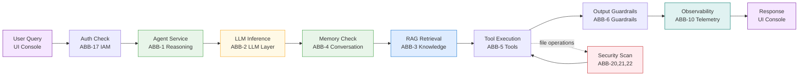
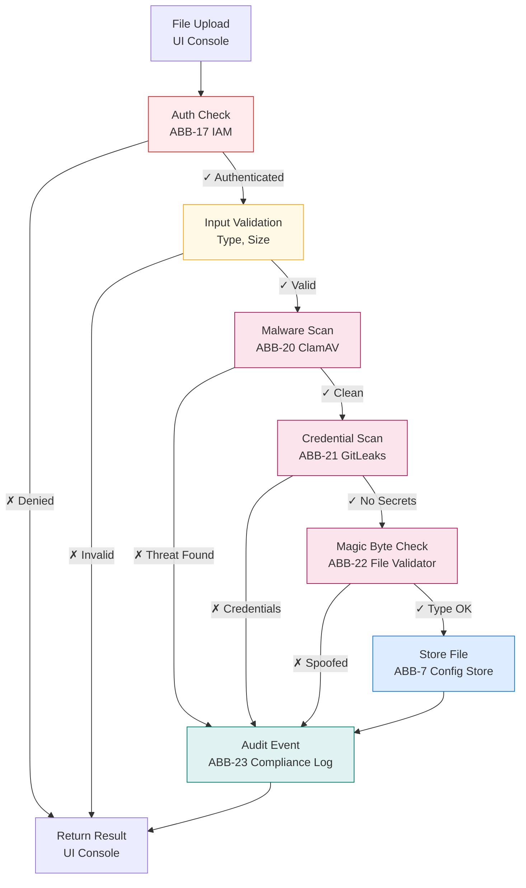
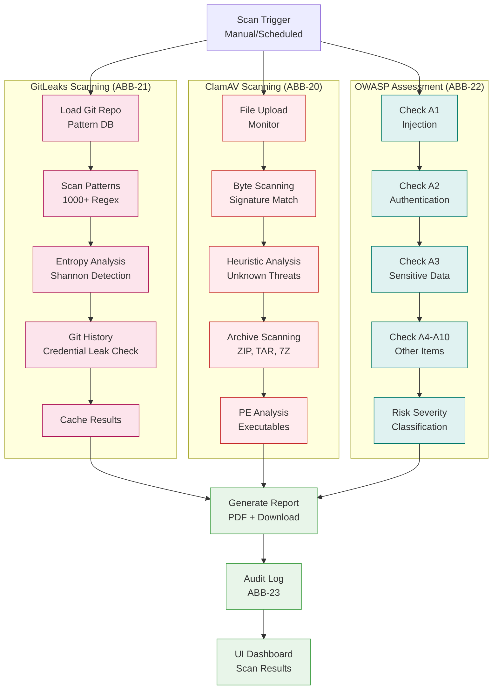

# Building Blocks

> **Architecture Building Blocks (ABBs)** define platform capabilities at the service layer. **Solution Building Blocks (SBBs)** map ABBs to concrete technology implementations. This document traces how each capability flows through the system, where components interact, and how security controls are woven throughout.

## Core Platform

| #   | Capability                 | Technology                                                                                                                                                                                                        | Source                                        |
| --- | -------------------------- | ----------------------------------------------------------------------------------------------------------------------------------------------------------------------------------------------------------------- | --------------------------------------------- |
| 1   | Agent Reasoning Engine     | LangGraph ReAct StateGraph                                                                                                                                                                                        | `graph.py`                                    |
| 2   | LLM Abstraction            | LangChain BaseChatModel — Ollama, Azure OpenAI, OpenAI, Foundry                                                                                                                                                   | `llm.py`                                      |
| 3   | Knowledge Management (RAG) | ChromaDB + LlamaIndex + PostgreSQL doc registry                                                                                                                                                                   | `vectorstore.py`, `advanced_retrieval.py`     |
| 4   | Conversation Memory        | SQLite conversations + rolling session summaries                                                                                                                                                                  | `memory.py`                                   |
| 5   | Tool Execution             | tools-service FastAPI (sandboxed) + delegate_to_agent                                                                                                                                                             | `tools.py`, tools `main.py`                   |
| 6   | Guardrails Engine          | LLM-based classifier + regex fallback, input & output gates                                                                                                                                                       | `graph.py`                                    |
| 7   | Configuration Store        | SQLite CRUD — 16 tables (incl. `platform_settings`), full versioning & audit                                                                                                                                      | `memory.py`                                   |
| 7b  | Skill File Store           | Disk-based per-skill isolated file storage (scripts, refs, assets)                                                                                                                                                | `memory.py`, `/data/filestore/skills/`        |
| 8   | A2A Protocol               | HTTP peer registry, agent cards, task dispatch                                                                                                                                                                    | `main.py`                                     |
| 9   | MCP Protocol               | Server registry, JSON-RPC tool discovery & invocation                                                                                                                                                             | `main.py`                                     |
| 10  | Observability              | OTel + Langfuse + Prometheus + Loki + Grafana                                                                                                                                                                     | `observability.py`                            |
| 11  | Workflow Automation        | n8n — 5 pre-built templates incl. multi-agent orchestration                                                                                                                                                       | `n8n/workflows/`                              |
| 12  | Platform Dashboard         | Express.js + EJS, 25 pages, thin API proxy                                                                                                                                                                        | `server.js`, `views/`                         |
| 13  | Multi-Agent Orchestration  | sub_agent_ids + delegate_to_agent + n8n DAGs                                                                                                                                                                      | `tools.py`, `graph.py`                        |
| 13b | Skill Workflow             | Sequential / Router skill execution ordering in Agent Builder                                                                                                                                                     | `agent-builder.ejs`                           |
| 14  | Data Connectors            | DB, REST API, Cloud Storage, Google Drive, SharePoint                                                                                                                                                             | `connectors/`                                 |
| 15  | LlamaIndex Integration     | Multi-format parsing, 5 retrieval modes, structured queries                                                                                                                                                       | `llamaindex_loader.py`, `structured_query.py` |
| 16  | Admin Plane                | 6-tab control centre: service health, LLM management, DB ops, config (security considerations, best practices), audit. Hash-based tab navigation. Platform-wide settings editable here only (read-only elsewhere) | `admin.ejs`, `server.js`                      |
| 17  | Authentication & IAM       | PBKDF2-SHA256 password hashing, session auth, RBAC (admin/member/viewer), email verification, password reset, workspace scoping                                                                                   | `memory.py`, `main.py`, `server.js`           |
| 18  | Login UI                   | React 18 + Vite SPA — login, register, email verify, forgot/reset password                                                                                                                                        | `ui-login/`, `public/login-app/`              |
| 19  | AI Safety Posture          | Intelligence Hub coverage checks for must-have controls: injection/jailbreak, PII+secrets, grounding/citations, toxicity+bias, compliance, operational fallback                                                   | `intelligence-hub.ejs`                         |

## Detail: Agent Reasoning Engine

```
retrieve_context → reason → execute_tools → generate_response
                     ↑            │
                     └────────────┘  (loop until done or max iterations)
```

- **State**: `AgentState` TypedDict (prompt, history, kb_context, tool_calls, response)
- **Iteration Control**: `MAX_REACT_ITERATIONS` env var (default 5), `should_continue()` edge
- **Guardrail Injection**: Input guardrails in `reason()`, output guardrails in `generate_response()`

## Detail: LLM Layer

| Provider         | Use Case              | Selection                       |
| ---------------- | --------------------- | ------------------------------- |
| Ollama           | Local dev, zero cost  | Default — `LLM_PROVIDER=ollama` |
| Azure OpenAI     | Enterprise compliance | `LLM_PROVIDER=azure-openai`     |
| OpenAI           | Latest models         | `LLM_PROVIDER=openai`           |
| Azure AI Foundry | Managed deployment    | `LLM_PROVIDER=azure-foundry`    |

Runtime switching via `POST /models/switch`. Per-model capabilities exposed on `GET /models`.

## Detail: RAG Pipeline

```
Ingest:   Document → Chunk (1000/200) → Embed → ChromaDB collection
Retrieve: Query → Embed → Similarity search → Top-K context → Inject into prompt
```

**Retrieval Modes** (per-agent `retrieval_mode`):

- `basic` — Direct ChromaDB cosine similarity
- `hybrid` — Keyword + vector search combined
- `reranked` — Cross-encoder reranking
- `sentence_window` — Surrounding sentence context
- `auto_merging` — Hierarchical chunk merging

## Detail: Tool Execution

35 tools, split across two services:

| Location                   | Tools                                                                                           | Why                              |
| -------------------------- | ----------------------------------------------------------------------------------------------- | -------------------------------- |
| tools-service (HTTP)       | math, http_fetch, file ops, datetime, web_search, code_execute, etc.                            | Crash isolation, SSRF protection |
| agent-service (in-process) | vector_search, vector_store, delegate_to_agent, advanced_search, query_database, query_csv_data | Low-latency RAG + delegation     |

**Sandboxing**: URL whitelist, blocked imports, filename sanitisation, 10s timeout, AST-safe eval.

### Tool Reference

| #   | Tool                   | Type  | Endpoint                         | Parameters                                                                                                     | Status                        |
| --- | ---------------------- | ----- | -------------------------------- | -------------------------------------------------------------------------------------------------------------- | ----------------------------- |
| 1   | `math`                 | proxy | POST /tools/math                 | `expression` (string)                                                                                          | ✅                            |
| 2   | `http_fetch`           | proxy | POST /tools/http-fetch           | `url` (string)                                                                                                 | ⚠️ Requires external internet |
| 3   | `file_write`           | proxy | POST /tools/file-write           | `filename` (string), `content` (string)                                                                        | ✅                            |
| 4   | `file_read`            | proxy | POST /tools/file-read            | `filename` (string)                                                                                            | ✅                            |
| 5   | `file_list`            | proxy | POST /tools/file-list            | `directory` (string), `pattern` (string)                                                                       | ✅                            |
| 6   | `file_search_content`  | proxy | POST /tools/file-search-content  | `query` (string), `pattern` (string), `max_results` (int)                                                      | ✅                            |
| 7   | `datetime_tool`        | proxy | POST /tools/datetime             | _(none)_                                                                                                       | ✅                            |
| 8   | `web_search`           | proxy | POST /tools/web-search           | `query` (string), `max_results` (int)                                                                          | ✅                            |
| 9   | `code_execute`         | proxy | POST /tools/code-execute         | `code` (string), `language` (string)                                                                           | ✅                            |
| 10  | `text_summarize`       | proxy | POST /tools/text-summarize       | `text` (string), `max_sentences` (int)                                                                         | ✅                            |
| 11  | `text_transform`       | proxy | POST /tools/text-transform       | `text` (string), `operation` (string)                                                                          | ✅                            |
| 12  | `text_diff`            | proxy | POST /tools/text-diff            | `text_a` (string), `text_b` (string), `context_lines` (int)                                                    | ✅                            |
| 13  | `text_extract`         | proxy | POST /tools/text-extract         | `text` (string), `extract_type` (string)                                                                       | ✅                            |
| 14  | `json_transform`       | proxy | POST /tools/json-transform       | `data` (string), `operation` (string), `jq_path` (string)                                                      | ✅                            |
| 15  | `csv_parse`            | proxy | POST /tools/csv-parse            | `csv_text` (string), `operation` (string), `filter_column` (string), `filter_value` (string), `max_rows` (int) | ✅                            |
| 16  | `yaml_convert`         | proxy | POST /tools/yaml-convert         | `content` (string), `direction` (string)                                                                       | ✅                            |
| 17  | `base64_codec`         | proxy | POST /tools/base64-codec         | `text` (string), `operation` (string)                                                                          | ✅                            |
| 18  | `hash_generate`        | proxy | POST /tools/hash-generate        | `text` (string), `algorithm` (string)                                                                          | ✅                            |
| 19  | `uuid_generate`        | proxy | POST /tools/uuid-generate        | `count` (int)                                                                                                  | ✅                            |
| 20  | `regex_match`          | proxy | POST /tools/regex-match          | `text` (string), `pattern` (string), `flags` (string)                                                          | ✅                            |
| 21  | `url_parse`            | proxy | POST /tools/url-parse            | `url` (string)                                                                                                 | ✅                            |
| 22  | `html_strip`           | proxy | POST /tools/html-strip           | `html` (string), `keep_links` (bool)                                                                           | ✅                            |
| 23  | `markdown_to_html`     | proxy | POST /tools/markdown-to-html     | `markdown` (string)                                                                                            | ✅                            |
| 24  | `webpage_extract`      | proxy | POST /tools/webpage-extract      | `url` (string), `max_length` (int)                                                                             | ⚠️ Requires external internet |
| 25  | `dns_lookup`           | proxy | POST /tools/dns-lookup           | `hostname` (string)                                                                                            | ✅                            |
| 26  | `json_schema_validate` | proxy | POST /tools/json-schema-validate | `data` (string), `schema_def` (string)                                                                         | ✅                            |
| 27  | `cron_parse`           | proxy | POST /tools/cron-parse           | `expression` (string)                                                                                          | ✅                            |
| 28  | `jwt_decode`           | proxy | POST /tools/jwt-decode           | `token` (string)                                                                                               | ✅                            |
| 29  | `environment_info`     | proxy | POST /tools/environment-info     | _(none)_                                                                                                       | ✅                            |
| 30  | `delegate_to_agent`    | local | in-process                       | `agent_id` (string), `task` (string)                                                                           | ✅                            |
| 31  | `vector_search`        | local | in-process (ChromaDB)            | `query` (string), `k` (int)                                                                                    | ✅                            |
| 32  | `vector_store`         | local | in-process (ChromaDB)            | `text` (string), `source` (string)                                                                             | ✅                            |
| 33  | `advanced_search`      | local | in-process (LlamaIndex)          | `query` (string), `mode` (string), `k` (int)                                                                   | ✅                            |
| 34  | `query_database`       | local | in-process (SQL)                 | `question` (string), `connection_string` (string), `tables` (string)                                           | ✅                            |
| 35  | `query_csv_data`       | local | in-process (Pandas)              | `question` (string), `csv_path` (string)                                                                       | ✅                            |

**⚠️ Network-dependent tools**: `http_fetch` and `webpage_extract` require outbound internet access from the Docker container. Behind corporate proxies, set `HTTP_PROXY` / `HTTPS_PROXY` environment variables in docker-compose.yml for the `tools-service`.

## Detail: Guardrails

```
Input:  PII detection, prompt injection (17 patterns), toxicity, topic restriction
Output: PII flagging, data-leak blocking, toxicity, length enforcement, hallucination check
```

- Single LLM call evaluates all enabled guardrails simultaneously
- Azure content filter auto-triggers toxicity detection
- Regex fallback ensures availability if LLM fails
- Per-agent guardrail assignment via `guardrail_ids`

## Detail: Skill Workflow

When an agent has 2+ skills attached, the Agent Builder displays a visual workflow editor:

| Mode       | Behavior                                                             |
| ---------- | -------------------------------------------------------------------- |
| Sequential | Skills execute in user-defined order — drag to reorder               |
| Router     | LLM dynamically selects the best skill per request (fan-out pattern) |

- Workflow config (`workflow_mode`, `workflow_order`) persisted with agent definition
- Visual flow: Start node → skill nodes (numbered, with tool counts) → End node
- Drag-and-drop reordering in sequential mode

## Traceability Matrix

| Capability                | Service                                   | Key File                                      | Status |
| ------------------------- | ----------------------------------------- | --------------------------------------------- | ------ |
| Agent Reasoning           | agent-service                             | `graph.py`                                    | ✅ |
| LLM Abstraction           | agent-service                             | `llm.py`                                      | ✅ |
| Knowledge/RAG             | agent-service + chromadb                  | `vectorstore.py`, `advanced_retrieval.py`     | ✅ |
| Memory                    | agent-service                             | `memory.py`                                   | ✅ |
| Tool Execution            | tools-service + agent-service             | `tools.py`, tools `main.py`                   | ✅ |
| Guardrails                | agent-service                             | `graph.py`                                    | ✅ |
| Config Store              | agent-service                             | `memory.py`                                   | ✅ |
| A2A / MCP                 | agent-service                             | `main.py`                                     | ✅ |
| Observability             | otel, langfuse, prometheus, loki, grafana | `observability.py`                            | ✅ |
| Workflows                 | n8n                                       | `n8n/workflows/`                              | ✅ |
| Dashboard & Admin         | ui-console                                | `server.js`, `views/admin.ejs`                | ✅ |
| Auth & IAM                | agent-service + ui-console + ui-login     | `memory.py`, `main.py`, `server.js`           | ✅ |
| Data Connectors           | agent-service                             | `connectors/`                                 | ✅ |
| Malware Detection         | tools-service                             | `security.py` (ClamAV integration)            | ✅ |
| Secret Scanning           | tools-service                             | `gitleaks.py` (credential detection)          | ✅ |
| OWASP Assessment          | ui-console                                | `admin.ejs` (compliance tab)                  | ✅ |
| Compliance Audit Log      | agent-service                             | `memory.py` (audit event store)               | ✅ |
| File Type Verification    | tools-service                             | `file_validator.py` (magic byte detection)    | ✅ |

---

## Component Interaction Flows

### 1. Agent Execution Flow Through Building Blocks



### 2. File Upload & Scanning Flow



### 3. Security Scanning Pipeline



---

## Security Scanning Building Blocks

### ABB-20: Malware Detection (ClamAV)

**Purpose**: Detect malicious files on upload across the platform.

**Technology Stack**:
- ClamAV 1.0.1 (antivirus engine)
- libmagic (file type verification)
- Signature database (real-time updates)

**Key Features**:
- Byte-level signature scanning (malware detection)
- Size validation (prevent archive bombs)
- Heuristic analysis (unknown threats)
- Archive scanning (ZIP, TAR, 7Z, RAR, 7Z)
- PE executable analysis (Windows binaries)
- Magic byte detection (file type spoofing)

**Data Flow**:
```
File Upload → Size Check → Magic Byte → ClamAV Scan → Result
                                            │
                                   ┌─────┴────────┐
                                   │              │
                            CLEAN (OK)      THREAT (Flag)
                                   │              │
                              Store File      Audit Log
```

**Audit Trail**:
- File name, size, upload user, scan timestamp
- Detection result (clean/threat)
- Threat classification (virus, trojan, PUP, etc.)
- Scan engine version

### ABB-21: Secret Scanning (GitLeaks)

**Purpose**: Detect leaked credentials, API keys, private keys before they enter the system.

**Technology Stack**:
- GitLeaks (1000+ patterns, entropy analysis)
- Git history scanner
- Entropy detection (Shannon analysis)
- Pattern matching (AWS keys, private keys, OAuth tokens)

**Key Features**:
- Pattern-based detection (AWS keys, Azure, GCP, private keys)
- Entropy analysis (high-entropy secret detection)
- Verification mode (test credentials for validity)
- Git history scanning (full repository scan)
- Context extraction (surrounding lines)
- Severity classification

**Detection Patterns**:
- AWS access keys (`AKIA[0-9A-Z]{16}`)
- Private RSA/PKCS keys
- OAuth2 tokens (Bearer, API keys)
- Database connection strings
- Cloud provider credentials (Azure, GCP)
- JWT tokens
- Slack/GitHub/API tokens

**Data Flow**:
```
Trigger Scan → Load Pattern DB → Scan Target
                                    │
                    ┌───┬───┬───┬──┴──┬──┐
                    │   │   │   │     │  │
                Pattern Hit Entropy High-Risk Medium-Risk Low-Risk None
                    │
              Extract Context
                    │
            Verify Credential
                    │
          Update Risk Classification
                    │
          Generate Report
```

**Audit Trail**:
- Scan timestamp, scope, patterns applied
- Findings (file, line, context)
- Severity (critical/high/medium/low)
- Verification status (if tested)
- Remediation actions

### ABB-22: OWASP Top 10 Assessment

**Purpose**: Continuous compliance checking against OWASP Top 10 vulnerabilities.

**Technology Stack**:
- OWASP Top 10 2021 checklist
- Static analysis patterns
- Best practice validators
- Risk severity framework

**Coverage**:
- **A01**: Broken Access Control (RBAC, permission checks)
- **A02**: Cryptographic Failures (encryption, TLS, hashing)
- **A03**: Injection (SQL, prompt, code injection guards)
- **A04**: Insecure Design (architecture review checklist)
- **A05**: Security Misconfiguration (env vars, defaults)
- **A06**: Vulnerable & Outdated Components (dependency audit)
- **A07**: Authentication Failures (session, MFA, password)
- **A08**: Software & Data Integrity Failures (updates, signatures)
- **A09**: Logging & Monitoring (audit events, telemetry)
- **A10**: SSRF (URL validation, whitelist checks)

**Assessment Flow**:
```
Manual/Scheduled Trigger
    │
    └─ Check Access Control (RBAC, permissions)
    │
    └─ Check Cryptography (TLS, passwords, keys)
    │
    └─ Check Injection Guards (guardrails, sanitization)
    │
    └─ Check Architecture (design patterns)
    │
    └─ Check Configuration (secrets, defaults)
    │
    └─ Check Dependencies (versions, CVEs)
    │
    └─ Check Auth (session, MFA, password policy)
    │
    └─ Check Integrity (signing, verification)
    │
    └─ Check Logging (audit, telemetry)
    │
    └─ Check Network (SSRF, URL validation)
    │
    Aggregate Results
    │
    Classify by Severity (Critical/High/Medium/Low)
    │
    Generate Report (PDF + Download)
    │
    Audit Log Event
```

**Risk Severity Levels**:
- **Critical** (Exploitable, high impact) — Requires immediate action
- **High** (Likely exploitable, significant impact) — Address within 1 sprint
- **Medium** (Potentially exploitable, moderate impact) — Address within 1 quarter
- **Low** (Theoretical risk, minimal impact) — Address in future hardening

### ABB-23: Compliance Audit Log

**Purpose**: Track all security and compliance events for accountability and forensics.

**Technology Stack**:
- SQLite event store (agent-service)
- Structured event schema
- User/timestamp tracking
- Search and filtering

**Event Types**:
- Policy updates (compliance rules changed)
- Access reviews (role/permission changes)
- Compliance checks (scan execution)
- Security incidents (threats detected)
- Scan results (ClamAV, GitLeaks, OWASP)
- Audit exports (report downloads)

**Event Schema**:
```json
{
  "timestamp": "2025-09-06T14:32:15Z",
  "event_type": "security_scan_completed",
  "user_id": "user_123",
  "workspace_id": "ws_main",
  "severity": "high",
  "resource_type": "file_upload",
  "resource_id": "file_456",
  "action": "malware_detected",
  "details": {
    "engine": "clamav_1.0.1",
    "threat_name": "Trojan.Generic",
    "file_name": "document.exe",
    "file_size": 245632,
    "scan_duration_ms": 1240
  },
  "metadata": {
    "ip_address": "192.168.1.100",
    "user_agent": "Mozilla/5.0...",
    "risk_level": "critical"
  }
}
```

**Retention Policy**:
- All events retained for minimum 90 days
- Critical events retained for 1 year
- Searchable by time range, event type, severity, user

---

## Component Integration Matrix

| From | To | Method | Purpose | Security Control |
|------|----|----|---------|------------------|
| UI Console | Agent Service | REST API | Agent execution | Auth + RBAC |
| UI Console | Tools Service | HTTP Proxy | Tool discovery | Auth + Rate Limit |
| UI Console | ClamAV | Direct | File scan | File size limit |
| UI Console | GitLeaks | Shell exec | Credential scan | Sandboxed process |
| Agent Service | ChromaDB | HTTP | RAG search | No auth (internal) |
| Agent Service | Ollama | HTTP | LLM inference | No auth (internal) |
| Agent Service | Tools Service | REST API | Tool execution | Service-to-service |
| Agent Service | n8n | HTTP Webhook | Trigger workflow | API key auth |
| Tools Service | ClamAV | Library import | Malware detect | Container isolation |
| Tools Service | GitLeaks | Shell exec | Secret detect | Process sandbox |
| OTel Collector | Prometheus | HTTP | Metrics push | Scrape auth |
| OTel Collector | Loki | gRPC | Logs push | TLS mutual auth |
| Prometheus | Grafana | Datasource | Visualization | Reverse proxy |

---

## Building Block Checklist

- [ ] **ABB-1 Agent Reasoning**: Verify ReAct loop termination conditions
- [ ] **ABB-2 LLM Abstraction**: Confirm model switching and fallback behavior
- [ ] **ABB-3 Knowledge/RAG**: Validate retrieval mode effectiveness
- [ ] **ABB-4 Memory**: Check conversation storage and rollover
- [ ] **ABB-5 Tool Execution**: Confirm sandbox isolation and timeout
- [ ] **ABB-6 Guardrails**: Test injection and PII detection
- [ ] **ABB-7 Config Store**: Verify versioning and audit trail
- [ ] **ABB-8 A2A Protocol**: Test peer discovery and delegation
- [ ] **ABB-9 MCP Protocol**: Verify tool auto-registration
- [ ] **ABB-10 Observability**: Confirm telemetry delivery
- [ ] **ABB-11 Workflows**: Test n8n webhook triggers
- [ ] **ABB-12 Dashboard**: Verify page load and API proxy
- [ ] **ABB-13 Multi-Agent**: Test orchestration and delegation
- [ ] **ABB-14 Data Connectors**: Confirm connector availability
- [ ] **ABB-15 LlamaIndex**: Test retrieval modes
- [ ] **ABB-16 Admin Plane**: Verify tab navigation and controls
- [ ] **ABB-17 Auth & IAM**: Test login, RBAC, workspace isolation
- [ ] **ABB-18 Login UI**: Verify SPA functionality
- [ ] **ABB-19 Safety Posture**: Confirm all controls present
- [ ] **ABB-20 Malware Detection**: Verify ClamAV scan accuracy
- [ ] **ABB-21 Secret Scanning**: Test pattern detection and entropy
- [ ] **ABB-22 OWASP Assessment**: Confirm all 10 items checked
- [ ] **ABB-23 Audit Log**: Verify event storage and filtering
