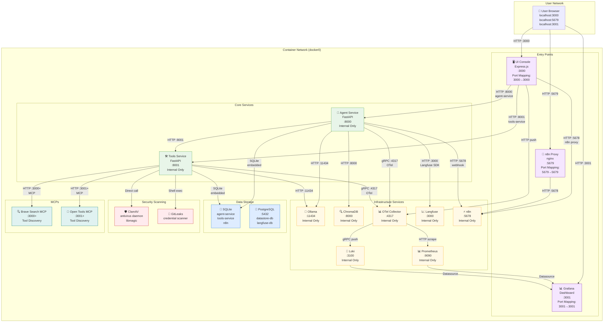
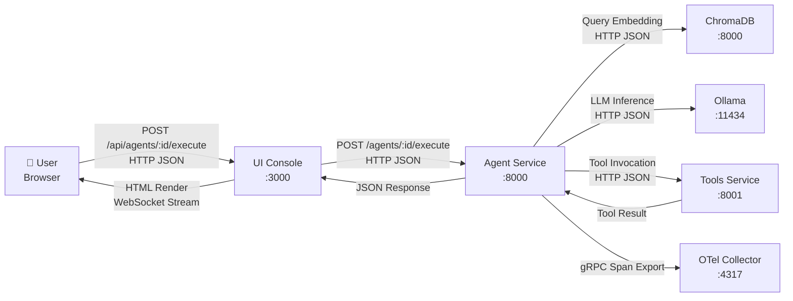
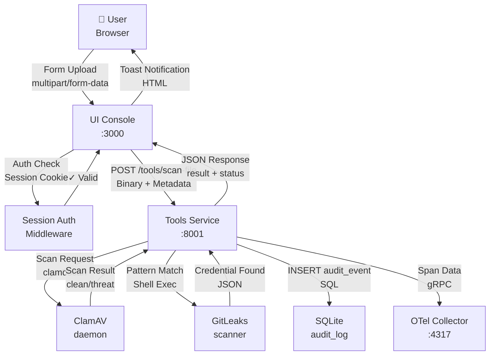
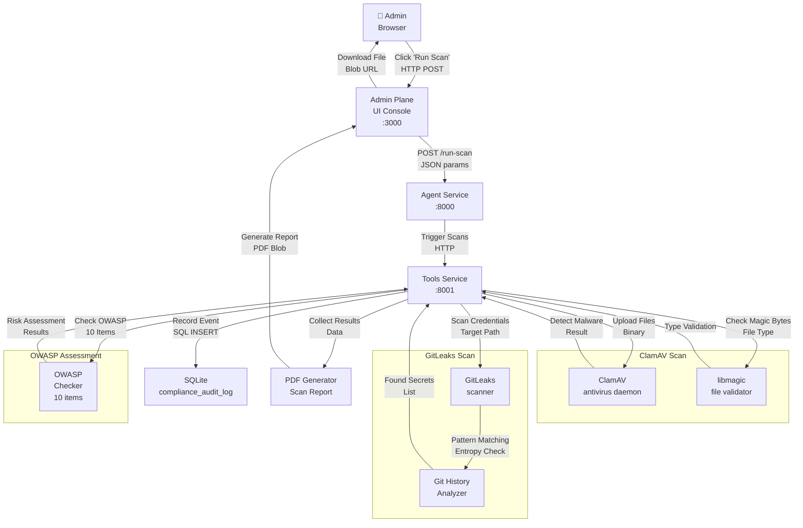
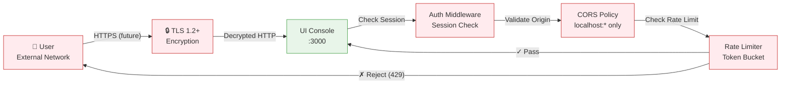
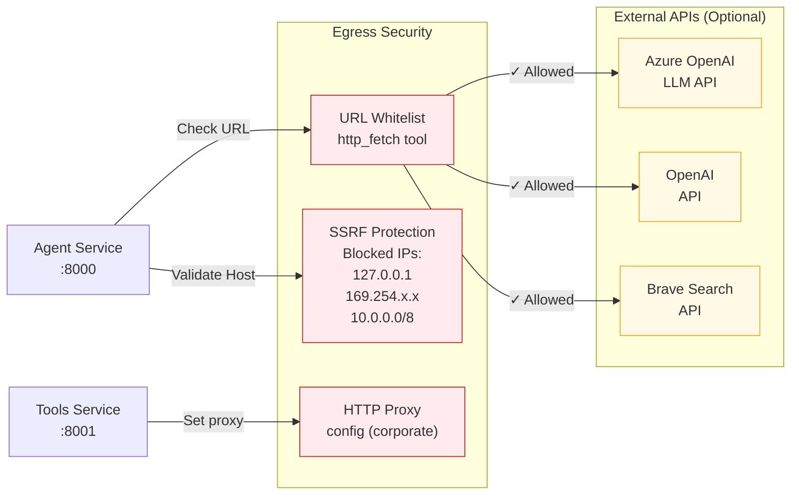
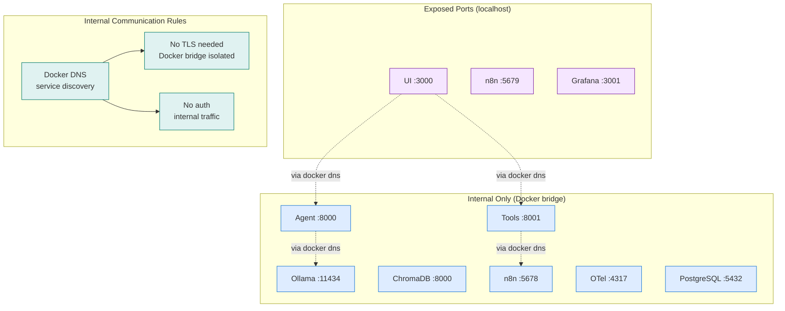

# Network Architecture

Comprehensive documentation of the Agentic Platform's network topology, communication flows, security boundaries, and integration patterns.

## Network Topology Overview



## Network Communication Flows

### Flow 1: User Query Execution



### Flow 2: File Upload & Scanning



### Flow 3: Security Scanning Pipeline



## Service-to-Service Communication

### HTTP REST API Endpoints

| From | To | Endpoint | Method | Protocol | Port | Auth |
|------|----|----|--------|----------|------|------|
| UI Console | Agent Service | `/agents` | GET/POST | HTTP JSON | 8000 | Bearer token (future) |
| UI Console | Agent Service | `/agents/:id/execute` | POST | HTTP JSON | 8000 | Bearer token |
| UI Console | Tools Service | `/tools` | GET | HTTP JSON | 8001 | Bearer token |
| UI Console | Tools Service | `/tools/:name/execute` | POST | HTTP JSON | 8001 | Bearer token |
| Agent Service | Tools Service | `/tools/:name/execute` | POST | HTTP JSON | 8001 | Service-to-service |
| Agent Service | n8n | `/webhook/agent-trigger` | POST | HTTP JSON | 5678 | API key (env var) |
| Tools Service | ClamAV | `/scan` (internal) | N/A | libclamav C API | N/A | N/A |
| Tools Service | Ollama | `/api/embeddings` | POST | HTTP JSON | 11434 | None (internal) |
| Agent Service | Ollama | `/api/generate` | POST | HTTP JSON | 11434 | None (internal) |
| Agent Service | ChromaDB | `/api/v1/collections` | GET/POST | HTTP JSON | 8000 | None (internal) |
| MCP Servers | Tool Discovery | `/resources` | GET | HTTP JSON | Dynamic | API key |

### gRPC Telemetry Flows

| From | To | Endpoint | Data | Protocol | Port |
|------|----|----|------|----------|------|
| Agent Service | OTel Collector | `/opentelemetry.proto.collector.trace.v1.TraceService/Export` | Spans | gRPC | 4317 |
| Tools Service | OTel Collector | `/opentelemetry.proto.collector.trace.v1.TraceService/Export` | Spans | gRPC | 4317 |
| OTel Collector | Prometheus | `/metrics` | Time-series | HTTP (scrape) | 9090 |
| OTel Collector | Loki | `/loki/api/v1/push` | Logs | gRPC | 3100 |

### WebSocket Streams (Real-time)

| From | To | Endpoint | Use Case | Port |
|------|----|----|----------|------|
| Agent Service | UI Console | `/api/agents/:id/stream` | Agent execution streaming | 3000 |
| UI Console | Browser | `/stream` | SSE progress updates | 3000 |

## Network Security Boundaries

### Boundary 1: User → Platform (Perimeter)



**Controls**:
- Session cookie (HttpOnly, SameSite=Strict)
- CORS whitelist (localhost only for dev)
- Rate limiting (5 auth attempts per 5 minutes per IP)
- CSRF token validation on state-changing operations
- Input validation (type checking, size limits)

### Boundary 2: Platform → External APIs (Egress)



**Controls**:
- URL whitelist for HTTP fetch tool
- SSRF protection (blocks private IPs)
- Proxy configuration for corporate networks
- TLS certificate validation
- API key rotation (env vars)

### Boundary 3: Internal Network (Container Bridge)



**Key Properties**:
- All internal services use Docker bridge network isolation
- DNS service discovery by container name
- No TLS certificates needed (Docker bridge is private)
- No authentication between internal services (network isolation provides security)
- External access only through three exposed entry points

## Port Mapping & Exposure

| Container | Internal Port | Host Port | Exposed | Purpose |
|-----------|---------------|-----------|---------|---------|
| ui-console | 3000 | 3000 | ✅ Yes | User dashboard |
| n8n-proxy | 5679 | 5679 | ✅ Yes | Workflow UI proxy |
| grafana | 3001 | 3001 | ✅ Yes | Monitoring dashboard |
| agent-service | 8000 | — | ❌ No | Internal API |
| tools-service | 8001 | — | ❌ No | Internal API |
| ollama | 11434 | — | ❌ No | Internal LLM |
| chromadb | 8000 | — | ❌ No | Internal vector DB |
| datastore-db | 5432 | — | ❌ No | Internal PostgreSQL |
| langfuse-db | 5432 | — | ❌ No | Internal PostgreSQL |
| n8n | 5678 | — | ❌ No | Internal workflow |
| otel-collector | 4317 | — | ❌ No | Internal telemetry |
| prometheus | 9090 | — | ❌ No | Internal metrics |
| loki | 3100 | — | ❌ No | Internal logs |
| langfuse | 3000 | — | ❌ No | Internal tracing |

## DNS & Service Discovery

### Docker Compose Service Names

All services available by container name on Docker bridge network:

```
agent-service:8000
tools-service:8001
ollama:11434
chromadb:8000
ui-console:3000
n8n:5678
n8n-proxy:5679
prometheus:9090
grafana:3001
loki:3100
otel-collector:4317
langfuse:3000
datastore-db:5432
langfuse-db:5432
```

### Resolution Examples

```
Agent Service connecting to Ollama:
  http://ollama:11434/api/generate

Tools Service connecting to n8n:
  http://n8n:5678/webhook/agent-trigger

ChromaDB collection from Agent:
  http://chromadb:8000/api/v1/collections
```

## Firewall Rules (docker-compose networking)

| Source | Destination | Port | Protocol | Allowed |
|--------|-------------|------|----------|---------|
| ui-console | agent-service | 8000 | HTTP | ✅ |
| ui-console | tools-service | 8001 | HTTP | ✅ |
| ui-console | n8n | 5678 | HTTP | ✅ |
| agent-service | tools-service | 8001 | HTTP | ✅ |
| agent-service | ollama | 11434 | HTTP | ✅ |
| agent-service | chromadb | 8000 | HTTP | ✅ |
| tools-service | ollama | 11434 | HTTP | ✅ |
| tools-service | n8n | 5678 | HTTP | ✅ |
| All → otel-collector | 4317 | gRPC | ✅ |
| All → postgres (if needed) | 5432 | TCP | ✅ |
| External | ui-console:3000 | 3000 | HTTP | ✅ |
| External | n8n-proxy:5679 | 5679 | HTTP | ✅ |
| External | grafana:3001 | 3001 | HTTP | ✅ |
| External | agent-service:8000 | 8000 | HTTP | ❌ |
| External | tools-service:8001 | 8001 | HTTP | ❌ |
| External | Internal Services | Any | Any | ❌ |

## Traffic Shaping & Load Characteristics

### Request Rate Profiles

```
Peak Load Scenario (10 concurrent agents):
- Agent execution requests: 10 req/s
- Tool execution calls: 50 req/s (5 tools per agent)
- LLM inference requests: 10 req/s
- Vector search queries: 15 req/s
- Total network throughput: ~5 MB/s (with streaming responses)
- Typical response latency: 2-5s (LLM time dominates)
```

### Data Flow Volumes

| Operation | Data Size | Frequency | Direction |
|-----------|-----------|-----------|-----------|
| Agent execution request | 50-500 KB | Per user query | Client → Platform |
| LLM streaming response | 100-1000 KB | Per LLM call | Platform → Client |
| Document ingestion | 1-100 MB | Per upload | Client → Platform |
| Vector embeddings | 50-500 KB | Per document chunk | ChromaDB ↔ Ollama |
| Telemetry spans | 1-5 KB | Per operation | Services → OTel |
| Audit log events | 1-2 KB | Per event | Services → SQLite |

## Scaling Implications

### Current Bottlenecks (Single-Node)

1. **SQLite single-writer** — concurrent tool execution queues behind write lock
2. **Ollama inference latency** — LLM generation time dominates request latency
3. **ChromaDB memory** — large knowledge bases may exceed container RAM
4. **Network latency** — HTTP overhead on container bridge (vs in-process)

### Multi-Node Scaling (Future ADR)

- PostgreSQL migration for concurrent writes
- Agent-service horizontal scaling behind reverse proxy
- Tools-service horizontal scaling (stateless)
- ChromaDB clustering or pgvector replacement
- Redis for distributed caching
- mTLS service mesh (Istio/Linkerd) for service-to-service auth