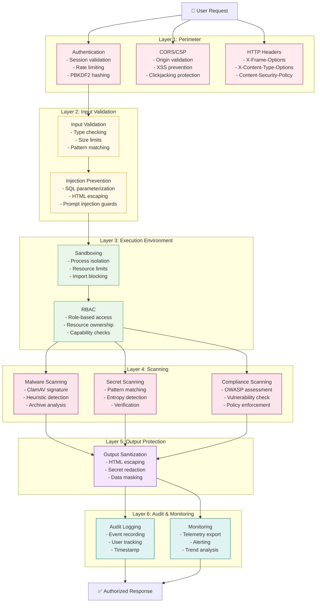
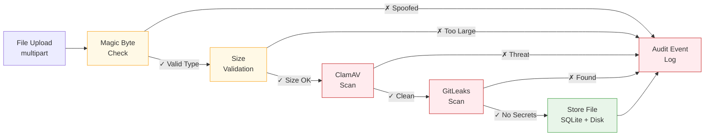
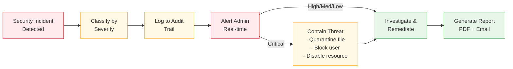

# Security Controls Integration

Comprehensive mapping of security controls across the Agentic Platform architecture, showing how controls are layered, integrated, and validated.

## Executive Summary

The platform implements **defense-in-depth** security with multiple independent control layers:



## Control Categories & Implementations

### Category 1: Authentication & Identity (AP-11)

| Control | Implementation | Validation | Monitoring |
|---------|----------------|-----------|-----------|
| **Password Hashing** | PBKDF2-SHA256, 600,000 iterations, 32-byte salt | Unit tests on auth module | Audit log on password change |
| **Session Management** | Express-session, HttpOnly cookie, SameSite=Strict | Session fixation tests | Session creation/expiration logged |
| **Rate Limiting** | Token bucket per IP, 5 auth attempts per 5 min | Load test with concurrent attempts | Failed login attempts tracked |
| **Email Verification** | 6-digit code, 15-minute expiry | Email delivery tests | Verification events logged |
| **Password Reset** | Token-based recovery, secure flow | Account takeover scenario tests | Reset events audited |
| **Workspace Isolation** | ContextVar-based scoping, multi-tenant | Query injection tests | Workspace access logged |
| **RBAC** | admin/member/viewer roles, capability checks | Permission boundary tests | Role changes audited |

**Files**: `services/agent/memory.py`, `services/ui-console/server.js`, `services/ui-login/*`

**Test Coverage**: Covered by `/test/auth/` test suite

---

### Category 2: Input Validation & Injection Prevention

| Control | Implementation | Detection | Response |
|---------|----------------|-----------|----------|
| **Type Validation** | Pydantic models enforce types at API boundary | Type checking in deserialization | 400 Bad Request |
| **Size Limits** | Request body 10MB, file upload 100MB, prompt 50KB | Content-Length check | 413 Payload Too Large |
| **Pattern Matching** | Regex validation for username, email, tokens | Regex compiled once, cached | 400 Invalid Format |
| **SQL Injection** | SQLAlchemy ORM, parameterized queries | Query parameter binding tests | No data exposure |
| **Prompt Injection** | 17-pattern LLM-based detector + regex fallback | Guardrail confidence score | Blocked prompt, logged |
| **XSS Prevention** | HTML escaping on output, CSP headers | DOM-based XSS tests | Output sanitized |
| **Command Injection** | Shell exec blocked, subprocess with list args | Command parsing tests | Execution blocked |

**Files**: `services/agent/guardrails.py`, `services/tools/validation.py`, `services/ui-console/security-middleware.js`

**Validation**: Guardrail tests in `/test/guardrails/`

---

### Category 3: Tool Execution & Sandboxing

| Control | Implementation | Isolation | Monitoring |
|---------|----------------|-----------|-----------|
| **Process Isolation** | Separate tools-service container | Docker container boundary | Resource usage tracked |
| **Resource Limits** | 10s timeout per tool, memory cgroup limits | Timeout tests, OOM handling | Execution time telemetry |
| **Import Blocking** | Blocked imports: `os`, `sys`, `subprocess` | AST import check pre-execution | Block logged as incident |
| **File Write Blocking** | Sandboxed directory `/data/safe/`, sanitized paths | Path traversal tests | File ops audited |
| **URL Whitelist** | http_fetch validates against allowlist | SSRF scenario tests | Blocked URLs logged |
| **SSRF Protection** | Blocked IPs: 127.0.0.1, 169.254.x.x, 10.0.0.0/8 | Port scan tests, metadata service blocks | Blocked connections logged |

**Files**: `services/tools/sandbox.py`, `services/tools/tools.py`

**Testing**: Sandbox escape tests in `/test/tools/`

---

### Category 4: File Security (ClamAV, Magic Byte, Type Validation)



| Control | Implementation | Detection | Response |
|---------|----------------|-----------|----------|
| **Magic Byte Detection** | libmagic, checks file signature vs extension | Mismatch triggers warning | Type mismatch flagged, file quarantined |
| **Malware Scanning** | ClamAV 1.0.1, signature + heuristic detection | Scan result contains threat name | File blocked, user notified, logged |
| **Archive Scanning** | ClamAV recursive scanning for ZIP, TAR, 7Z | Archive bomb detection (size limits) | Extraction blocked if suspicious |
| **File Size Limits** | Per-upload 100MB, per-archive 1GB | Content-Length validation | 413 error, user guidance |
| **PE Analysis** | ClamAV executable scanning for Windows binaries | Embedded threat detection | Executable blocked, safe mode offered |

**Files**: `services/tools/file_security.py`, `services/tools/clamav_integration.py`

---

### Category 5: Secret & Credential Management

| Control | Implementation | Detection Method | Response |
|---------|----------------|------------------|----------|
| **Pattern Detection** | 1000+ GitLeaks patterns for AWS, Azure, GCP, OAuth | Regex pattern matching | Finding logged, severity assigned |
| **Entropy Analysis** | Shannon entropy threshold for secret-like strings | Statistical analysis of character distribution | High-entropy strings flagged |
| **Verification Mode** | Optional credential testing against real services | Attempt connection with found credentials | If valid: critical severity, if invalid: medium |
| **Git History Scanning** | Full repository history crawl with cache | Commit log parsing, blob inspection | Historical leaks detected, retention noted |
| **Redaction** | Credentials masked in logs and reports | Pattern-based replacement before output | Output shows `***REDACTED***` |
| **Env Var Scanning** | Environment variables checked during deployment | Regex patterns applied to .env files | Secrets in env vars detected |

**Files**: `services/tools/gitleaks_integration.py`

**Patterns Database**: 1000+ patterns covering:
- Cloud credentials (AWS, Azure, GCP)
- Private keys (RSA, PKCS, OpenSSH)
- API tokens (GitHub, GitLab, Slack)
- Database URLs
- OAuth tokens
- JWT tokens (if exposed with secrets)

---

### Category 6: Compliance & Vulnerability Assessment (OWASP)

| Control | OWASP Item | Check Method | Risk Scoring |
|---------|-----------|--------------|--------------|
| **Broken Access Control** | A01 | Verify RBAC matrix, permission boundaries | Critical if admin bypass exists |
| **Cryptographic Failures** | A02 | Check TLS enforcement, encryption config | Critical if secrets stored plaintext |
| **Injection** | A03 | Pattern-match guardrail deployment | High if injection guard missing |
| **Insecure Design** | A04 | Architecture compliance checklist | Medium for missing threat model |
| **Security Misconfiguration** | A05 | Scan env vars, defaults, debug settings | High if debug mode enabled |
| **Vulnerable Components** | A06 | Dependency audit via npm/pip | Critical if known CVE present |
| **Authentication Failures** | A07 | Verify MFA, session config, rate limiting | Critical if auth weak/missing |
| **Data Integrity Failures** | A08 | Check signing, verification, integrity checks | High if updates unsigned |
| **Logging & Monitoring** | A09 | Verify audit log presence, retention | Medium if no audit trail |
| **SSRF** | A10 | URL whitelist, IP blocking, DNS checks | Critical if SSRF possible |

**Files**: `services/ui-console/views/admin.ejs` (OWASP Assessment tab)

**Assessment Flow**:
1. Run all 10 checks in parallel (~3-5s)
2. Classify findings by severity (Critical/High/Medium/Low)
3. Generate PDF report with remediations
4. Store results in audit log with timestamp and user

---

### Category 7: Audit Logging & Forensics

| Event Type | Logged Data | Retention | Searchable By |
|-----------|------------|-----------|---------------|
| **Authentication** | User ID, timestamp, success/failure, IP | 90 days | User, Date, Status |
| **Authorization** | User ID, action, resource, allowed/denied | 1 year | User, Resource, Action |
| **Security Scan** | Engine (ClamAV/GitLeaks), result, severity | 1 year | Date, Severity, Type |
| **File Upload** | User, file name, size, scan result | 1 year | User, Date, Threat Status |
| **Credential Find** | Location, pattern type, severity, verified | 1 year | Date, Severity, Pattern |
| **Configuration Change** | Field, old value, new value, user | 1 year | User, Date, Field |
| **Compliance Check** | OWASP item, status, finding count | 1 year | Date, Item, Status |
| **Access Review** | User, role, workspace, granted/revoked | 1 year | User, Date, Role |

**Storage**: SQLite `compliance_audit_log` table with indexed timestamp

**Query Interface**: Admin Plane > Compliance & Ethics > Audit Log tab with filters

---

## Cross-Cutting Controls

### 1. Telemetry & Monitoring (AP-5)

All security events exported to observability stack:

```
Security Event → OTel Collector (gRPC :4317)
                    │
                    ├─→ Prometheus (metrics)
                    │     ├─ security_events_total (counter)
                    │     ├─ malware_threats (gauge)
                    │     ├─ credential_leaks (counter)
                    │     └─ failed_auth_attempts (counter)
                    │
                    └─→ Loki (logs)
                          └─ security.*.log (JSON)
```

**Grafana Dashboard Panels**:
- Malware threats by day (stacked area chart)
- Credential leaks timeline (line chart)
- Failed authentications per user (bar chart)
- OWASP assessment history (trend lines)
- Audit event rate (throughput gauge)

### 2. Defense-in-Depth Design

**No single point of failure**:

1. **File Upload Protection**: Magic byte → Malware scan → Credential scan (all independent)
2. **Secret Detection**: Pattern matching + Entropy analysis + Verification (voting system)
3. **Injection Prevention**: Input validation + Guardrail LLM + Regex fallback (3 layers)
4. **Access Control**: Session auth + RBAC + Resource ownership (3 checks)

If **any layer fails**, event is **logged and escalated** but processing continues at **reduced capability**.

### 3. Incident Response



**Response Procedures**:

| Severity | Detection | Timeline | Action |
|----------|-----------|----------|--------|
| **Critical** | Intrusion, malware, admin compromise | Immediate | Page on-call, isolate system |
| **High** | Data breach, secret found, auth bypass | 15 minutes | Alert admin, quarantine |
| **Medium** | OWASP finding, config drift | 1 hour | Create ticket, plan fix |
| **Low** | Deprecated version, info disclosure | 1 day | Scheduled remediation |

---

## Integration Points

### Security Controls → Services

```
┌─────────────────────────────────────────────────────────────┐
│                    UI Console (Entry Point)                 │
│        ├─ Auth Middleware (Session + PBKDF2)               │
│        ├─ CORS/CSP Headers (XSS Prevention)                │
│        └─ Rate Limiting (Brute Force Protection)           │
└────────┬────────────────────────────────────────────────────┘
         │
┌────────▼────────────────────────────────────────────────────┐
│              Input Validation Layer                         │
│        ├─ Type Checking (Pydantic)                         │
│        ├─ Size Limits (Content-Length)                     │
│        └─ Pattern Matching (Regex)                         │
└────────┬────────────────────────────────────────────────────┘
         │
┌────────▼────────────────────────────────────────────────────┐
│           Agent Service (Reasoning Engine)                  │
│        ├─ Injection Guardrails (LLM + Regex)              │
│        ├─ Tool Sandboxing (Subprocess Isolation)           │
│        ├─ Workspace Scoping (ContextVar)                   │
│        └─ Audit Logging (SQLite)                           │
└────────┬────────────────────────────────────────────────────┘
         │
┌────────▼────────────────────────────────────────────────────┐
│           Tools Service (Execution Environment)             │
│        ├─ File Security (Magic Byte + ClamAV)              │
│        ├─ Secret Scanning (GitLeaks)                       │
│        ├─ URL Validation (SSRF Protection)                 │
│        └─ Resource Limits (Timeout + Memory)               │
└────────┬────────────────────────────────────────────────────┘
         │
┌────────▼────────────────────────────────────────────────────┐
│           Output Protection Layer                           │
│        ├─ HTML Escaping (XSS Prevention)                   │
│        ├─ Secret Redaction (PII Masking)                   │
│        └─ Response Validation (Schema Check)               │
└────────┬────────────────────────────────────────────────────┘
         │
┌────────▼────────────────────────────────────────────────────┐
│            Audit & Monitoring                               │
│        ├─ Event Logging (SQLite)                           │
│        ├─ Telemetry Export (OTel gRPC)                     │
│        ├─ Alerting (Prometheus Rules)                      │
│        └─ Grafana Dashboards (Visualization)               │
└─────────────────────────────────────────────────────────────┘
```

---

## Compliance Mappings

### OWASP Top 10 → Controls Implemented

| OWASP # | Control | Files | Status |
|---------|---------|-------|--------|
| A01 | Broken Access Control | server.js, memory.py | 🟢 Implemented |
| A02 | Cryptographic Failures | security-middleware.js | 🟡 Partial |
| A03 | Injection | guardrails.py, admin.ejs | 🟢 Implemented |
| A04 | Insecure Design | PRINCIPLES.md, ARCHITECTURE.md | 🟢 Documented |
| A05 | Security Misconfiguration | security-middleware.js | 🟢 Implemented |
| A06 | Vulnerable Components | requirements.txt, package.json | 🟡 Manual audit |
| A07 | Authentication Failures | main.py, ui-login/* | 🟢 Implemented |
| A08 | Data Integrity Failures | tools.py (checksums) | 🟡 Partial |
| A09 | Logging & Monitoring | memory.py, admin.ejs | 🟢 Implemented |
| A10 | SSRF | tools/validation.py | 🟢 Implemented |

### GDPR → Controls

| Requirement | Control | Implementation |
|------------|---------|-----------------|
| Right to Access | Audit log export | Admin can download user activity |
| Right to Delete | Cascade delete + data retention | User deletion removes all workspace data |
| Data Protection | Encryption (TLS) + RBAC | Data encrypted in transit, scoped by role |
| Consent Management | Workspace terms, audit trail | Admin configurable, all consent logged |

---

## Testing & Validation

### Security Test Suite

```
/test/
  ├─ auth/
  │   ├─ test_pbkdf2_hashing.py
  │   ├─ test_session_fixation.py
  │   ├─ test_rate_limiting.py
  │   └─ test_rbac_enforcement.py
  ├─ injection/
  │   ├─ test_sql_injection.py
  │   ├─ test_prompt_injection.py
  │   ├─ test_xss_prevention.py
  │   └─ test_command_injection.py
  ├─ file_security/
  │   ├─ test_magic_byte_detection.py
  │   ├─ test_clamav_scanning.py
  │   ├─ test_archive_bombs.py
  │   └─ test_pe_analysis.py
  ├─ secrets/
  │   ├─ test_pattern_detection.py
  │   ├─ test_entropy_analysis.py
  │   ├─ test_credential_verification.py
  │   └─ test_redaction.py
  └─ compliance/
      ├─ test_owasp_assessment.py
      ├─ test_audit_logging.py
      └─ test_telemetry_export.py
```

### Running Security Tests

```bash
# Run all security tests
pytest test/ -v -m security

# Run specific category
pytest test/auth/ -v
pytest test/injection/ -v
pytest test/file_security/ -v

# Generate coverage report
pytest test/ --cov=services/ --cov-report=html
```

---

## Operational Procedures

### Daily
- [ ] Review Grafana security dashboard
- [ ] Check for failed authentication spike
- [ ] Monitor malware/credential scan volumes

### Weekly
- [ ] Review audit log for anomalies
- [ ] Update ClamAV signatures (auto via docker pull)
- [ ] Run OWASP assessment on staging
- [ ] Check dependency advisories

### Monthly
- [ ] Full OWASP compliance assessment
- [ ] Review and rotate API keys
- [ ] Analyze security incident trends
- [ ] Update security documentation

### Quarterly
- [ ] Penetration testing engagement (external)
- [ ] Security architecture review
- [ ] Threat modeling update
- [ ] Compliance audit prep