# Agentic Platform — Architecture Diagram

```mermaid
%%{init: {'theme': 'base', 'themeVariables': {'primaryColor': '#e8f4fd', 'primaryBorderColor': '#4a90d9', 'secondaryColor': '#f0f7e6', 'tertiaryColor': '#fff3e0', 'background': '#fafbfc'}}}%%

flowchart TD
    %% ─── User Input ───
    User([👤 User Input])

    %% ─── Frontend Layer ───
    subgraph FE["🖥️ Frontend Layer"]
        direction TB
        FE_DESC["Routes requests & platform dashboard"]
        EXPRESS["<b>Express.js</b> + EJS"]
        PAGES["23 UI Pages"]
    end

    %% ─── Agent Orchestrator ───
    subgraph ORCH["🧠 Agent Orchestrator"]
        direction TB
        ORCH_DESC["The system's brain, manages<br/>end-to-end agent flow"]
        FASTAPI["<b>FastAPI</b>"]
        LANGGRAPH["🦜 <b>LangGraph</b><br/>ReAct Agent"]
    end

    %% ─── Decision ───
    DECISION{{"❓ Need external<br/>knowledge?"}}

    %% ─── LLM Layer ───
    subgraph LLM["🤖 LLM Layer"]
        direction TB
        LLM_DESC["Multi-provider support"]
        OLLAMA["🦙 <b>Ollama</b> (local)<br/>Llama 3, Mistral, Gemma"]
        AZURE_OAI["☁️ <b>Azure OpenAI</b><br/>GPT-4o, GPT-4"]
        OPENAI["🔮 <b>OpenAI</b><br/>GPT-4o, o1"]
        FOUNDRY["🏭 <b>Azure AI Foundry</b>"]
    end

    %% ─── RAG Pipeline ───
    subgraph RAG["📚 RAG Pipeline"]
        direction TB
        RAG_DESC["Retrieval-Augmented Generation"]
        RETRIEVAL_BASIC["<b>Basic Mode</b><br/>Direct similarity search"]
        RETRIEVAL_ADV["<b>Advanced Mode</b><br/>Hybrid + Rerank"]
        LLAMAINDEX["🦙 <b>LlamaIndex</b><br/>Retrieval framework"]
        CHROMADB["🟠 <b>ChromaDB</b><br/>Vector store"]
    end

    %% ─── Tool Use ───
    subgraph TOOLS["🔧 Tool Use"]
        direction TB
        TOOLS_DESC["Dynamic tool discovery & execution"]
        MCP["<b>MCP Servers</b><br/>Model Context Protocol"]
        A2A["<b>A2A Protocol</b><br/>Agent-to-Agent delegation"]
        BUILTIN["<b>Built-in Tools</b><br/>Math, HTTP, File, DateTime"]
        N8N["<b>n8n</b><br/>Workflow automation"]
    end

    %% ─── Data Layer ───
    subgraph DATA["🗄️ Data Layer"]
        direction TB
        DATA_DESC["Persistent state & memory"]
        SQLITE["<b>SQLite</b><br/>Conversations, agents,<br/>skills, sessions"]
        FILESTORE["<b>File Store</b><br/>Documents & notes"]
    end

    %% ─── Observability Layer ───
    subgraph OBS["📊 Observability Layer"]
        direction TB
        OBS_DESC["Full-stack monitoring"]
        OTEL["<b>OpenTelemetry</b><br/>Collector"]
        PROMETHEUS["<b>Prometheus</b><br/>Metrics"]
        GRAFANA["<b>Grafana</b><br/>Dashboards"]
        LOKI["<b>Loki</b><br/>Logs"]
        LANGFUSE["<b>Langfuse</b><br/>LLM Tracing"]
    end

    %% ─── Deployment Layer ───
    subgraph DEPLOY["🚀 Deployment Layer"]
        direction LR
        DOCKER["🐳 <b>Docker Compose</b><br/>21 containers"]
    end

    %% ─── Connections ───
    User --> FE
    FE --> ORCH
    ORCH --> DECISION
    DECISION -->|"YES"| RAG
    DECISION -->|"NO"| LLM
    RAG -->|"Context"| LLM
    ORCH --> TOOLS
    TOOLS -->|"Results"| ORCH
    LLM -->|"Response"| ORCH
    ORCH -->|"Application<br/>State"| DATA
    DATA -->|"Memory &<br/>History"| ORCH
    RAG --- CHROMADB
    RAG --- LLAMAINDEX

    %% ─── Observability spans everything ───
    ORCH -.->|"Traces"| OBS
    FE -.->|"Metrics"| OBS

    %% ─── Deployment ───
    DEPLOY ~~~ DATA

    %% ─── Styling ───
    classDef frontend fill:#e3f2fd,stroke:#1976d2,stroke-width:2px,color:#0d47a1
    classDef orchestrator fill:#fff3e0,stroke:#f57c00,stroke-width:2px,color:#e65100
    classDef llm fill:#f3e5f5,stroke:#7b1fa2,stroke-width:2px,color:#4a148c
    classDef rag fill:#e8f5e9,stroke:#388e3c,stroke-width:2px,color:#1b5e20
    classDef tools fill:#fce4ec,stroke:#c62828,stroke-width:2px,color:#b71c1c
    classDef data fill:#fff8e1,stroke:#f9a825,stroke-width:2px,color:#f57f17
    classDef obs fill:#e0f2f1,stroke:#00796b,stroke-width:2px,color:#004d40
    classDef deploy fill:#eceff1,stroke:#455a64,stroke-width:2px,color:#263238
    classDef decision fill:#fffde7,stroke:#fbc02d,stroke-width:2px,color:#f57f17

    class FE frontend
    class ORCH orchestrator
    class LLM llm
    class RAG rag
    class TOOLS tools
    class DATA data
    class OBS obs
    class DEPLOY deploy
    class DECISION decision
```

## Quick Reference

| Layer             | Components                                | Purpose                                        |
| ----------------- | ----------------------------------------- | ---------------------------------------------- |
| **Frontend**      | Express.js + EJS, 23 pages                | Platform dashboard & API proxy                 |
| **Orchestrator**  | FastAPI + LangGraph                       | ReAct agent loop, routing, state               |
| **LLM**           | Ollama, Azure OpenAI, OpenAI, AI Foundry  | Multi-provider inference                       |
| **RAG Pipeline**  | ChromaDB + LlamaIndex                     | Basic (fast) / Advanced (hybrid+rerank) / None |
| **Tool Use**      | MCP, A2A, n8n, Built-in tools             | Dynamic tool discovery & execution             |
| **Data**          | SQLite, File Store                        | Conversations, agents, skills, memory          |
| **Observability** | OTel, Prometheus, Grafana, Loki, Langfuse | Metrics, logs, LLM traces                      |
| **Deployment**    | Docker Compose (21 containers)            | Single-command local stack                     |
