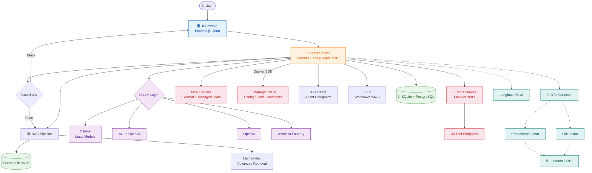

# Architecture Diagram

## Layer Summary

| Layer         | Components                                | Purpose                        |
| ------------- | ----------------------------------------- | ------------------------------ |
| Frontend      | Express.js + EJS (25 pages)               | Dashboard & API proxy          |
| Orchestrator  | FastAPI + LangGraph                       | ReAct loop, routing, state     |
| LLM           | Ollama, Azure OpenAI, OpenAI, Foundry     | Multi-provider inference       |
| RAG           | ChromaDB + LlamaIndex                     | Retrieval-augmented generation |
| Tools         | tools-service, MCP (external + managed), A2A, n8n | Tool execution & automation    |
| Data          | SQLite + PostgreSQL                       | Config, memory, documents      |
| Observability | OTel, Prometheus, Grafana, Loki, Langfuse | Metrics, logs, LLM traces      |
